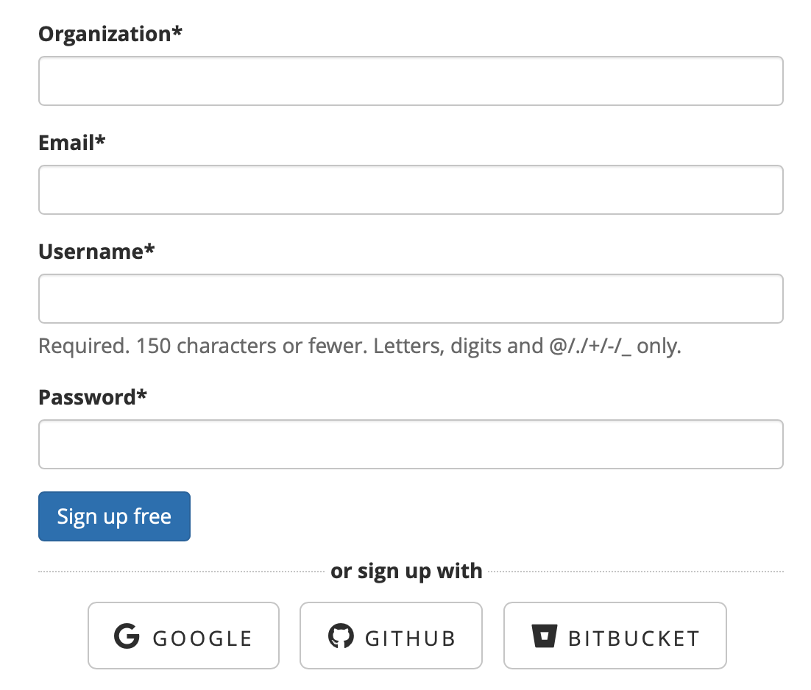

# Signing up

Before you ****get started, you must first [create an account](https://app.sleuth.io/account/signup/). Once that's done, we'll connect to a change source, which is usually your code repo. 

If you already have a Google, GitHub or Bitbucket account, you can create and access your Sleuth account with those credentials if you wish. After you have successfully logged in, you can get started by creating your first Sleuth [project](projects.md#creating-a-project).

