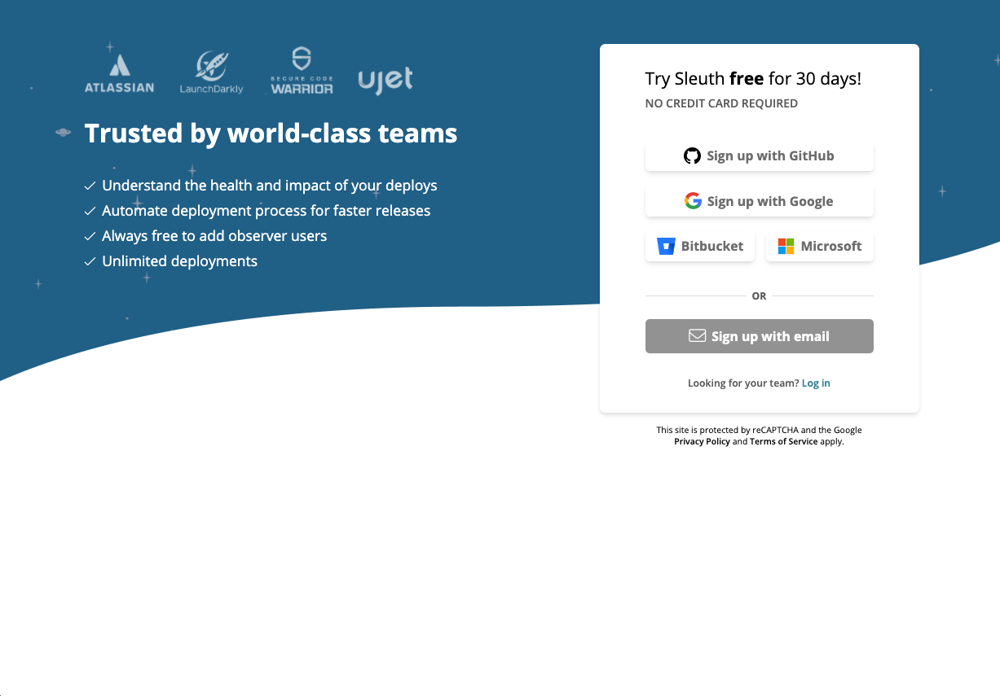
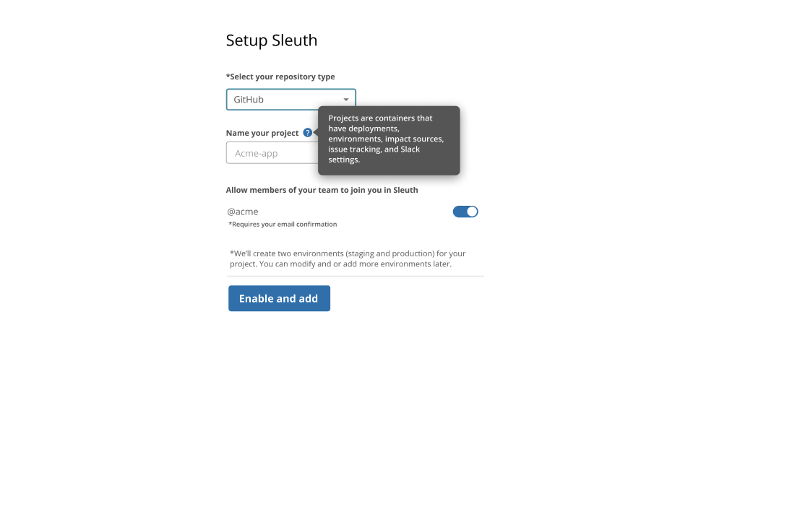
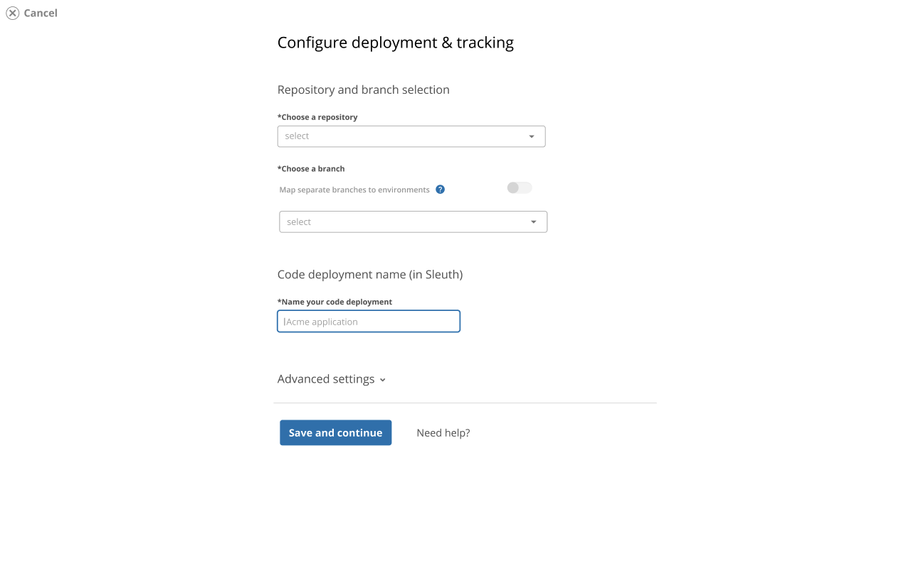
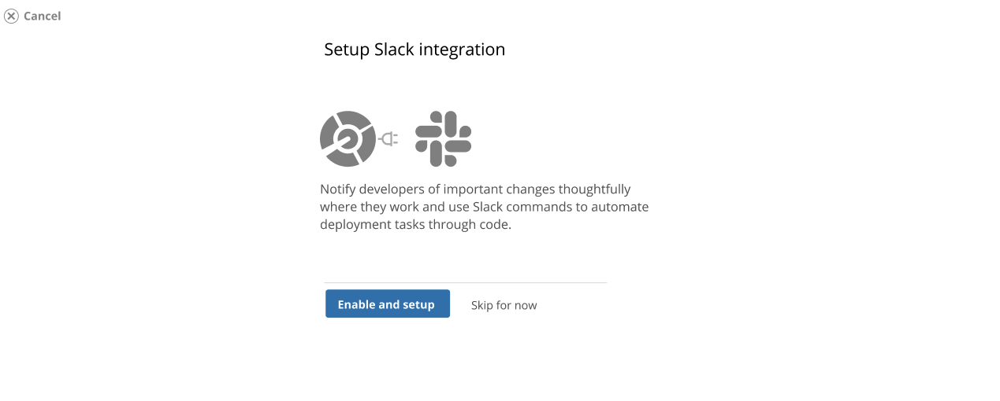
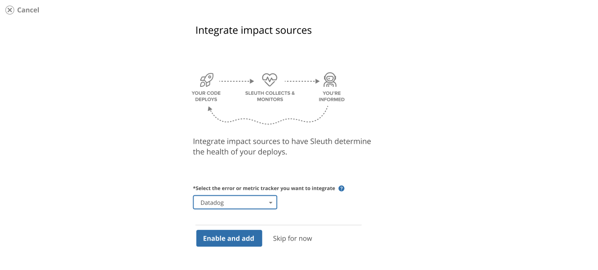

# Getting started

## Sleuth is a deployment-based metrics tracker.

Sleuth tracks Accelerate metrics by way of tracking deployments, making it a useful tool for both developers and managers alike.

## Setup [deployment & metrics tracking](modeling-your-deployments/) in 5 minutes

Getting started with **Sleuth** takes about 5 minutes. Link your code and Sleuth will instantly begin to track  your deploys.

* [ ] **Create a Sleuth account.** You'll need one to get started. You can create an account via OAuth using your Google, GitHub, or Bitbucket account. [Signup](https://app.sleuth.io/account/signup/) is instant and setup takes less than 5 minutes! 
* [ ] **Setup your** **organization and project**. You can make as many projects as needed to model your deployments, but Sleuth creates one for you by default. Each project contains two default environments: _Production and Staging_.
* [ ] **Connect your code**, from a Git repository in GitHub, Bitbucket, GitLab. Sleuth will instantly analyze your commits, pull requests and authors and show you meaningful, actionable data.
* [ ] **Setup a webhook to let us know when you deploy**. Sleuth works with your tools and **every deployment system**. Our light-weight, [webhook-based deploy registrations](modeling-your-deployments/code-deployments/how-to-register-a-deploy.md) means you're up and running in moments with your existing tooling.



#### Sign up to Sleuth




**Setup your project and connect your source provider**




#### Configure your first code deployment




#### Connect more integrations to realize the power of Sleuth

Gain team deploy notifications, personal message when your changes ship and powerful slash commands to _sleuth_ important information about your deploys by **enabling Slack**

Verify the health of your deploys by integrating your Observability and setting up deploy Impact 

[Learn more](integrations-1/about-integrations.md) about integrations. 



#### Take control with your Sleuth Command Center!




