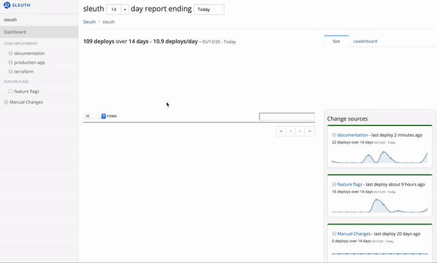

# Welcome!

Sleuth helps track software deployments through your remote team's complete DevOps stack. It also helps you improve uptime and stop change-related incidents before they ship. 

It only takes a few minutes to connect Sleuth to a change source and start analyzing the health of your code. 

A change source can be a code deployment on Bitbucket, GitHub or GitLab; feature flags on LaunchDarkly; or issues on Clubhouse or Jira, with [many other integrations](integrations-1/about-integrations....md) available. 

