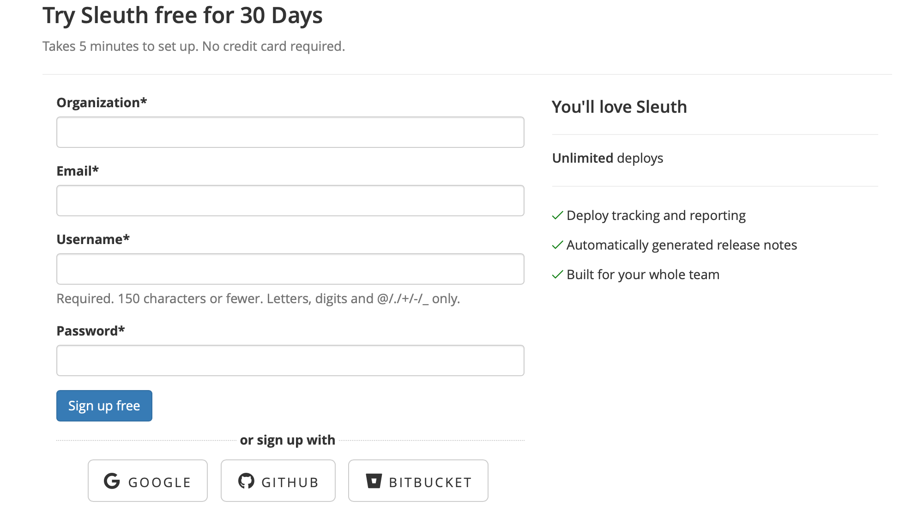

# Getting started

Before you get started with Sleuth, you must first [create an account](https://app.sleuth.io/account/signup/). You can try Sleuth free for 30 days. Pricing information can be found [here](https://www.sleuth.io/pricing).

If you already have a Google, GitHub or Bitbucket account, you can sign up with those instead. After you have successfully logged in, you can create your first Sleuth Project!

Get Sleuth up and running in four easy steps:



Add a name and description for your project.



Connect GitHub, Bitbucket and LaunchDarkly change source integrations; Slack ChatOps integrations; and Jira and Clubhouse issue tracking integrations.

Enable GitHub to track deploys made via your code repositories. See pull requests, commits, authors and issues associated with every deploy.

Enable Bitbucket to track deploys made via your code repositories. See pull requests, commits, authors and issues associated with every deploy.

Enable LaunchDarkly to track changes made via your feature flags. Associate your flag changes with your code deployments.

Enable Slack to stay on top of your changes and alert your developers when they have changes deployed.

Enable Jira to track the issues and epics you are deploying to your users.

Enable Clubhouse to track the issues and epics you are deploying to your users.



You can add existing members to your organization or add the email address of someone you'd like to have invited to join your organization. If the invitation's accepted, the user will automatically be added to your organization. You can also [configure your organization](https://app.sleuth.io/organization/trailmaster/signup/) so that anyone signing up with an email from your company's domain will automatically join your organization without any additional action needed.



Add a code deployment to start tracking your changes:

* See commits, issues, pull requests, changed files and authors for every deploy.
* Quickly see when you've rolled out code and exactly what's changed to help squash bugs.
* Release notes sent to your Slack team channels.
* See an aggregate of what's been deployed today, this week or this month.
* Allow everyone in your organization to understand what code changes you're shipping.



