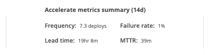
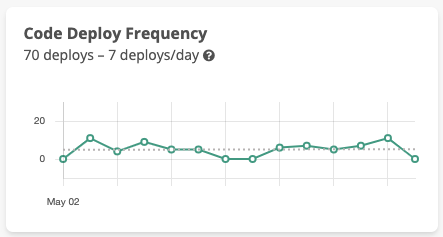
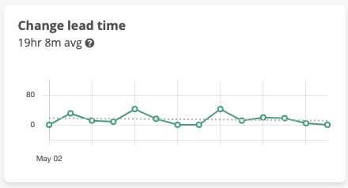
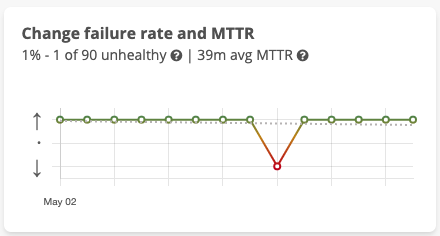

# Accelerate metrics

Once you've setup [deployment tracking](modeling-your-deployments/) and [auto-verification of deploys](auto-verify-your-deploys/) Sleuth provides an accurate and flexible view into your [projects](modeling-your-deployments/projects/) Accelerate \(DORA\) metrics. 

## Deploy frequency

Sleuth shows you the **deploy frequency** for all [code deployments](modeling-your-deployments/code-deployments/) and [feature flags](modeling-your-deployments/feature-flags.md) you've setup within a [project](modeling-your-deployments/projects/) and [environment](modeling-your-deployments/environment-support.md). Sleuth allows you to see your deploy frequency for each [environment](modeling-your-deployments/environment-support.md) you maintain.

Sleuth will show you the individual deploy frequency for each deployment as well as show you the blended frequency on your project command center. Using the trends date range picker you can see your projects deploy frequency, broken down by day, over any period. The number of deploys per day is calculated by taking the total number of deploys and dividing by five. We remove weekends from the deploy per day calculation.

## Change lead time

Sleuth tracks **change lead time**, defined as the time from your first commit to deploy, for all your [code deployments](modeling-your-deployments/code-deployments/) and for each configured [environment](modeling-your-deployments/environment-support.md). Because Sleuth tracks deployments and not just pull requests or branches we can provide an accurate change lead time that includes all the commits and pull requests that went into a deploy. 

For instance, let's say that you deploy every merged pull request to your staging environment. However, let's also say that you bulk up all changes made in a day in staging and deploy them together to your production environment. With this style of work you'll see small change lead times for each staging deploy. However, the change lead time for your production deploy will include all the pull requests and the extended deploy time it took for them to make it to production. 

## Change failure rate and MTTR

What a team defines as **change failure** is very specific to the team. It can be as simple as a change that causes a hard-down incident or as nuanced as fluctuation in a business level metric. Sleuth allows teams to flexibly define what failure means to them by defining change failure via [deploy verification](auto-verify-your-deploys/) and impact tracking.

Sleuth's impact tracking allows you to integrate error trackers, such as Sentry and Rollbar, metrics trackers, like AWS CloudWatch and Datadog and incident trackers, like Statuspage and Pagerduty \(coming soon\). When Sleuth auto-verifies a deploy as Unhealthy that deploy is considered a failure. Setting a deploy to Unhealthy manually will also be considered a failure.

**Mean time to recovery or MTTR** is defined in Sleuth as the time a project spends in a failure state. For instance, let's say you make a deploy that adds 25% to your database CPU. Assume that Sleuth is tracking this impact and determines that the deploy is Unhealthy. You team has setup [slack notifications](modeling-your-deployments/projects/notifications.md) in Sleuth and as a result your mean time to discovery or MTTD is basically zero. Your team jumps into action and initiates a rollback which takes 25 minutes to complete. Once your rollback is deployed Sleuth sees that your database CPU has gone back down to normal and auto-verifies the deploy as Healthy. Your **MTTR** in this scenario would be **25 minutes**, the amount of time it took for your team to return your project to a healthy state.

