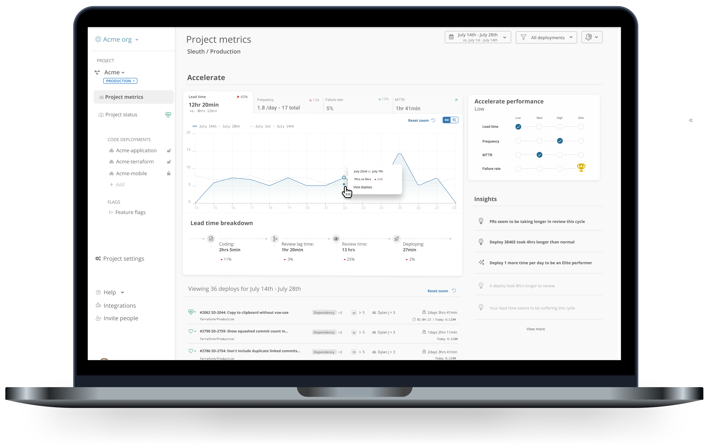

# Accelerate metrics

The larger your team grows and the faster your teams move, the harder it is for engineering leaders to find _trust but verify_ moments. Sleuth metrics provide a dedicated dashboard, detailed breakdowns, industry standard rankings, actionable insights and the tools your developers need to improve. Sleuth will accelerate your team's development and deployments today!

If you’re an engineering lead, Sleuth will make sure you have the insights you need to know how your team is performing, where they may be encountering bottlenecks and how to remove them.

A healthy team depends on trust between team and leadership. Sleuth helps you verify without breaking trust with your developers.

Sleuth's metrics experience allows you to:

* Easily understand if your performance is steady, improving or taking a turn for the worse by exploring your metrics performance for any period, with comparisons to the previous period
* Dive into actionable insights that help you spot where your team is running into bottlenecks and how to remove them
* See where your team ranks in relation to industry standards and what it will take to reach the next level
* Let the information come to you with weekly, bi-weekly or monthly email-based metrics digests and insights 
* Quickly implement the tools your teams need to improve their Accelerate metrics and deployment process

