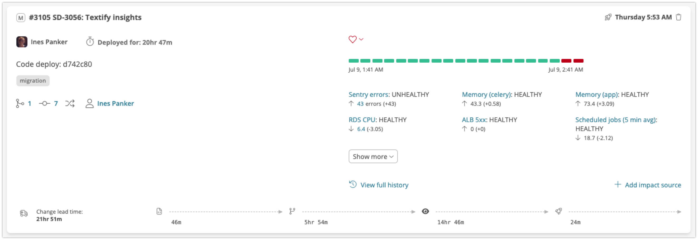

# Change lead time

 (2) (1).png>)

**Change lead time** measures the time it takes for a change to go from its initial start of coding to being deployed in its target environment. Like [Deploy frequency](deploy-frequency.md), **Change lead time** is a measure of _speed_ (whereas [Change failure rate](change-failure-rate.md) and [MTTR](mttr.md) are measures of _quality_, or _stability_). &#x20;

Sleuth calculates **Change lead time** for all your [code deployments](../modeling-your-deployments/code-deployments/) and for each configured [environment](../modeling-your-deployments/environment-support.md). Because Sleuth tracks not just your pull requests or branches, but your actual _deploys_, we're able provide a highly accurate **Change lead time** that includes all the commits, pull requests, and issues that went into a deploy.‌

By default, the "start of the clock" for **Change lead time** is the time of the first code commit included in the Deploy. However, Sleuth also provides a Project-level option to start the clock at the first moment that any issue included in the Deploy is transitioned to any state within your issue tracker that you tell Sleuth to treat as an "in-progress" state. For more on issue-based CLT, refer to [Starting CLT based on first issue transition](change-lead-time.md#starting-clt-based-on-first-issue-transition) below.

Consider the following example using the default CLT start definition (i.e. the moment of first commit). Let's say that you deploy every merged pull request to your staging environment. However, let's also say that you bulk up all changes made in a day in staging and deploy them together to your production environment. With this style of work you'll see smaller **Change lead times** for each staging deploy. However, the **Change lead time** for your production deploy will include all the pull requests and the extended deploy time it took for them to make it to production.

For more on how Sleuth measures **Change lead time**, check out Sleuth CTO, Don Brown, explaining it in detail in this SleuthTV episode!


Sleuth CTO Don Brown explains how Sleuth calculates Change lead time


## Lead time breakdowns

In addition to showing the average Change lead time for all deploys in a selected period, Sleuth also provides a detailed breakdown of how much time your teams, on average, are spending:

* **Coding** - the time spent from first commit (or alternatively, the time spent from the first transition of an issue to an "in-progress state) to when a pull request is opened
* **Review lag time** - the time spent between a pull request being opened and the first review
* **Review time** - the time spent from first review to the pull request being merged
* **Deploying** - the time spent from pull request merge to deployment

In addition to the averages found on the metrics dashboards you can always see exactly where time was spent for each deploy via its detailed view.

For a more detailed timeline, including events from issue creation to deploy verification, you can always consult the [timeline](https://help.sleuth.io/modeling-your-deployments/deploy-cards#deploy-card-timeline-icons) for each deploy.


On Sleuth dashboards the change lead time and breakdowns are the averages for each deploy across the period.&#x20;

On the deploy view the change lead time and breakdowns are the averages for each pull request that was deployed.

You can view the individual change lead time and breakdowns for an individual pull request by viewing the_`PRs`_tab on the deploy view.


## Feature flags and Change lead time

Sleuth [supports feature flags](../modeling-your-deployments/feature-flags.md) as a first class form of change. That said, feature flags are an instantaneous change to your running deployments. Therefore feature flags don't have a lead time or breakdown. Sleuth excludes feature flag changes from the lead time graph and associated deploy list.

## Setting up Change lead time

Sleuth uses our [code integrations](https://help.sleuth.io/integrations-1/code-deployment) (Github, Bitbucket, Gitlab, etc) coupled with our [deployment tracking](../modeling-your-deployments/) and, if you've elected to use the issue-based CLT start definition, our [issue tracker integrations](../integrations-1/issue-trackers/) to build a complete picture of your team's lead time. Once you've connected your code to Sleuth and setup your first [Code Deployment](../modeling-your-deployments/code-deployments/) Sleuth automatically tracks your change lead time for each deploy.

See [Interpreting metrics in Sleuth](how-we-calculate.md) for additional information on how to interpret Sleuth's presentation of Change lead time and the other DORA metrics

### Starting CLT based on first issue transition

By default, Sleuth starts the CLT clock at the moment of first code commit. However, Sleuth also provide the option on a project-by-project basis to start the CLT clock at the first transition of any included issues to any states that you define to be "in progress" in your issue tracker.

To enable this option, perform the following steps:

* **Prerequisite**: before enabling issue-based CLT for a Project, you must first ensure that that Project has an Issue Tracker integration enabled and configured. See [Issue tracker integrations](../integrations-1/issue-trackers/) for details
* From the left-hand-navigation, select the Project for which you want to enable issue-based CLT start definition.
* Expand the **More** drawer and select **Project Settings**&#x20;
* Scroll down and expand the **Advanced Settings** section
* Under the **Change lead time** **settings** heading, change **Start definition** to **First issue transition to state**
* Use the **Project selection** drop-down to select the desired issue workflow from your issue tracker.&#x20;
  * **NOTE:** The purpose of this selection is to tell Sleuth which workflow state model to present in the next field. In Jira, issue workflows are tied to Jira Projects (hence the name of this field), but in other issue trackers, issue workflows might be tied to other entities (i.e. in Linear, workflows are defined for Teams, and so those are what you'll see in this drop-down if you're using Linear)
* In the **Issue states** drop-down, select _all states that should be counted_ _as "in progress" staets with regard to your CLT definition_. It's important that you select _all_ such states because some issue tracker workflows are more free-form than others (e.g. allowing an issue to go straight from "To Do" to "In Review"). Sleuth will look for the earliest transition into any of the states you select here (including cases where the issue is initially _created_ in one of these states), so it's important to be exhaustive here.
* Note that in cases where no issue start states are detected or where the first commit pre-dates the earliest issue transition, Sleuth will use that first commit as the start time for CLT.

<figure><figcaption></figcaption></figure>

## Working Hours and Change lead time

Many customers want the change lead time clock to stop on weekends, holidays, or based on individual users' working hours.&#x20;

Users can set their individual working hours on their [Account settings](../settings/account/) page, and administrators can set Organization-level working hours in [Organization settings](../settings/organization/) page.&#x20;

Organization-level working hours will be applied for any users that don't have their own working hours specified (this includes any Contributor users that do not have direct access to Sleuth).&#x20;

For any users that have set their own working hours, their user-level working hours will override Organization-level working hours. &#x20;

Per the above logic, the CLT clock continues ticking on a PR as long as any authors or reviewers on the PR are currently working.&#x20;

## Further Reading

For additional information on how Sleuth calculates and presents Change lead time and other DORA metrics throughout its various dashboards and views, see [Interpreting metrics in Sleuth](how-we-calculate.md).
