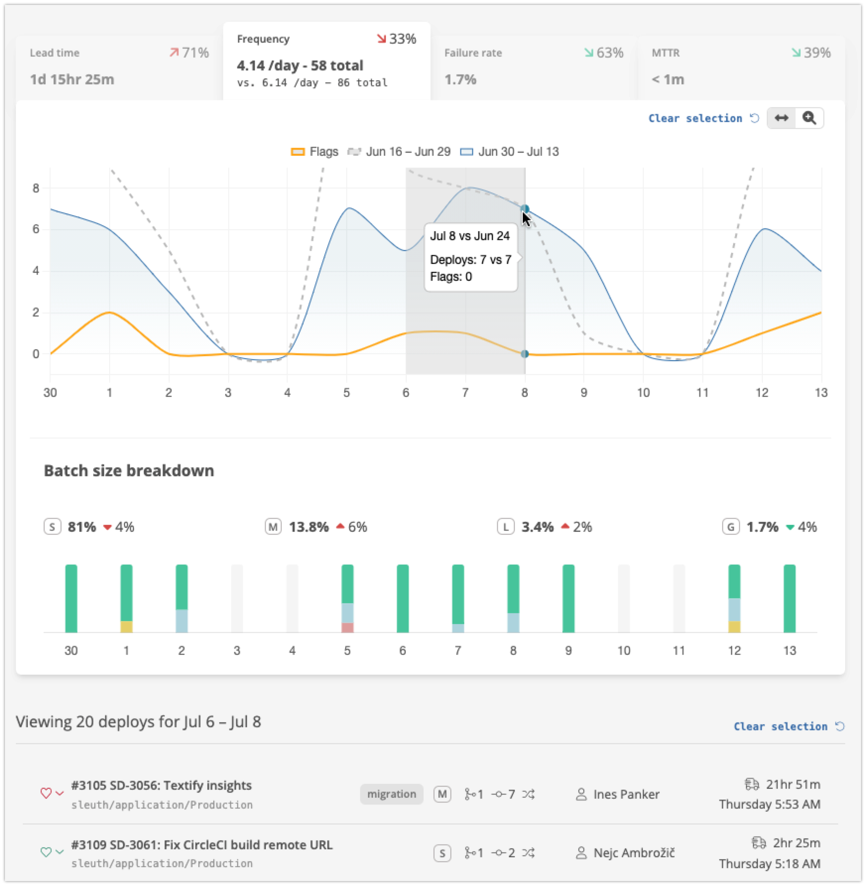

# Deploy frequency

Sleuth shows you the **deploy frequency** for all [code deployments](https://app.gitbook.com/@sleuth/s/sleuth/~/drafts/-MeWnutYNH4HzDA3uu11/modeling-your-deployments/code-deployments) and [feature flags](https://app.gitbook.com/@sleuth/s/sleuth/~/drafts/-MeWnutYNH4HzDA3uu11/modeling-your-deployments/feature-flags) you've setup within a [project](https://app.gitbook.com/@sleuth/s/sleuth/~/drafts/-MeWnutYNH4HzDA3uu11/modeling-your-deployments/projects) and [environment](https://app.gitbook.com/@sleuth/s/sleuth/~/drafts/-MeWnutYNH4HzDA3uu11/modeling-your-deployments/environment-support). Sleuth allows you to see your deploy frequency for each [environment](https://app.gitbook.com/@sleuth/s/sleuth/~/drafts/-MeWnutYNH4HzDA3uu11/modeling-your-deployments/environment-support) you maintain.‌

## Batch size breakdowns

The Sleuth project metrics dashboard shows the total number of deploys and the frequency, deploys per day in the period. We also provide a detailed breakdown of the batch size of each deploy as a percentage of the total and broken down per day. Batch size is defined as a blend of number of pull requests, number of commits and amount of code changed, weighted in that order. Batch sizes are defined as: 

* Small - usually 1 pull request, 1 - 10 commits and a few hundred lines of code changed 
* Medium - usually 1 - 2 pull requests, 10 - 30 commits and many hundreds of lines of code changed
* Large - usually 2 - 4 pull requests, 20 - 40 commits and many hundreds of lines of code changed
* Gigantic - usually 4 or more pull requests or 30 or more commits or many thousands of lines of code changed


Because batch size is a weighted blend of pull requests, commits and code changes you can find that an especially large amount of change in any of those elements can cause a deploy to be deemed Large or Gigantic.


## Feature flags and frequency

Sleuth [supports feature flags](../modeling-your-deployments/feature-flags.md) as a first class form of change. That said we find that teams want to understand the distinction between their code deploy frequency and their flag change frequency. The Sleuth metrics dashboard shows the two frequencies as separate graph lines and allows you to toggle on or the other on and off. To see totals for flag frequency you can hover over a data point. 

## Setting up deploy frequency

Sleuth uses our [code integrations](https://help.sleuth.io/integrations-1/code-deployment) \(Github, Bitbucket, Gitlab, etc\) coupled with our [deployment tracking](../modeling-your-deployments/) to understand when you've deployed. Once you've connected our code to Sleuth and setup your first [Code Deployment](../modeling-your-deployments/code-deployments/) and start [registering deploys](../modeling-your-deployments/code-deployments/how-to-register-a-deploy.md) Sleuth will automatically track your deploy frequency and batch size breakdown for each deploy to each of your defined [Environments](../modeling-your-deployments/environment-support.md).

Sleuth uses our [LaunchDarkly integration](../integrations-1/feature-flags/launchdarkly.md) to track feature flag changes. Once setup we'll automatically start tracking your flag frequency across each of your defined [Environments](../modeling-your-deployments/environment-support.md). 


For the most accurate metrics we recommend using a [webhook to register](https://help.sleuth.io/modeling-your-deployments/code-deployments/how-to-register-a-deploy#precise-deploy-registration-via-a-webhook) your deploys. However, initially Sleuth is setup to count a pull request merge as a deploy until we've received your first webhook.


