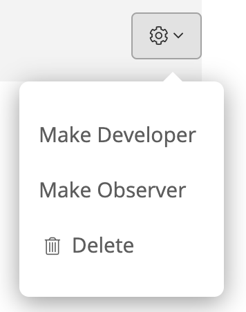

# Access Control

Sleuth uses a role-based access control \(RBAC\) method to restrict access to the Sleuth application. Every organization by default has a single owner, who can then assign roles to  other members. Depending on the given role, members within the organization can handle billing, add new members and assign roles, adjust settings for integrations and deployments, or can simply be read-only viewers of the Dashboard. 

Different roles control what parts of Sleuth your users can see and change: 

* **Owner**: Organization owner. **The owner account cannot be deleted.**  
* **Administrator**: Can do anything. 
* **Developer**: Can add integrations and deployments, but not users. 
* **Observer**: Can only view deployment information.

To manage your organization's members, go to **Organization Settings &gt; Members**, then select the cog dropdown next to the user to change their role:

  

You can invite new members and assigned roles by entering their e-mail address in the _Member_ field, selecting a role, then pressing **Invite**. The invitation will be displayed in the member list. When they accept the invitation, their Gravatar, role, name, and email address will be displayed. 

