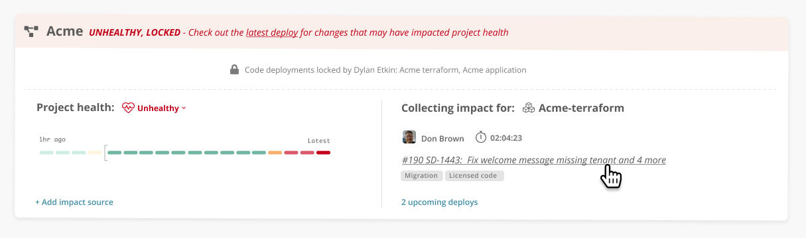

# Auto-verify deploys

Once a deploy has shipped how does your team know if the change was good or bad? How long does it take for your team to discover this? Minutes, hours, days or weeks?

[Impact tracking](../integrations-1/impact-sources/) in Sleuth uses your [key SLIs](https://en.wikipedia.org/wiki/Service_level_indicator) to let you know if your deploys are getting the job done or causing new problems. Coupled with personal [Slack notifications](https://help.sleuth.io/notifications), developers know the impact of their changes moments after they deploy.

Sleuth monitors the SLIs that define your application’s health and applies [anomaly detection](anomaly-detection.md) to automatically verify the health of your deploys. Sleuth [integrates with your existing best-in-class](../integrations-1/impact-sources/) error trackers and observability tools. Get Impact tracking setup in just 5 minutes!

Auto-verification of your deploys with Impact tracking allows you to:

* Easily include production health in your developers definition of done, no more tracking down graphs and trying to understand what normal should look like, Sleuth alerts authors directly in Slack when a deploy is unhealthy
* Avoid creeping, incremental declines in performance, memory, cpu usage and more. Know when your changes take your service out of its normal range!
* Automate deploy locking or creating rollback pull requests when Sleuth sees an unhealthy deploy

