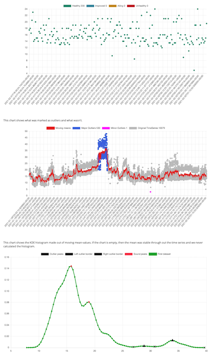

# Anomaly detection

Sleuth applies anomaly detection algorithms to your impact data to do the heavy lifting required to determine what is normal and what is not.

All developers want to ship changes that are making systems better, not worse. However, in our modern environments it's often difficult to know:

* What metrics are important?
* Where do you find those metrics?
* And once found, what's normal and what's something to be worried about

Trust Sleuth to let you know when your [metrics](metric-impact.md) or [errors](error-impact.md) are out of your normal range. We'll let you know within 2 minutes of your last deploy, right in Slack, where your developers already live.

The more data Sleuth collects the more we know what's normal for your team. For example, perhaps you're a team that keeps your errors empty by fixing every error that occurs. Or perhaps, which is often more realistic, you always have normal number of errors what you've decided you're willing to accept. Sleuth's anomaly detection means your developers don't need to "magically know" which errors are normal and which are out of your norm.

