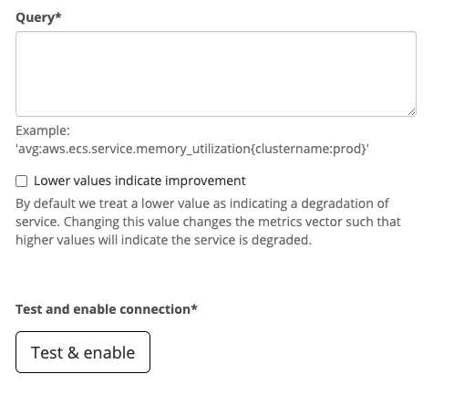

# Metric impact

**Metric trackers** or Observability tools track SLIs and data from key stats reported by your applications. Connect your cloud metrics provider to Sleuth so we can automatically verify the health of your deploys. Metrics impact are specific to a Sleuth [project](../modeling-your-deployments/projects/) and [environment](../modeling-your-deployments/environment-support.md) and will be used to determine the health of that project/environment combination.


Health verification is different from alerting! Alerting is for when your system is in strife and the on-call must be contacted. Impact lets you know when a metrics has changed in a significant way. For example, a new code change cause 5% more memory to be used. This may not breach an alerting level but it is something the developer who made the change should know and choose to accept or to fix.


Metrics trackers such as [AWS CloudWatch](../integrations-1/impact-sources/metrics/aws-cloudwatch.md), [Datadog](../integrations-1/impact-sources/metrics/datadog.md), [NewRelic](../integrations-1/impact-sources/metrics/newrelic.md) and [SignalFx](../integrations-1/impact-sources/metrics/signalfx.md) allow users to specify a query, specific to the provider, that allows you us retrieve complex data and transforms from the system. When [creating a Metric impact](../settings/project/impact.md) in Sleuth we will ask for a query that defines the value we will track:

You will need to be familiar with your metrics providers query language to configure a metric impact in Sleuth. Sleuth allows you to test your query to make sure we'll get the right values for your metric.
