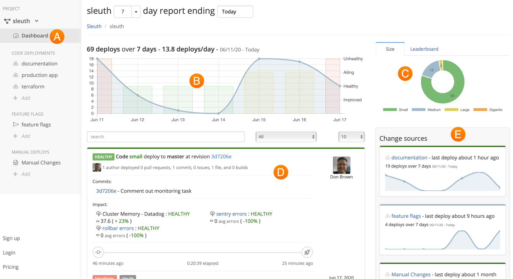

# About...

The **Dashboard** is Sleuth's command central, where all of the data your disparate tools generate are aggregated and presented to you in a clean, easy-to-use interface. 

All the data Sleuth collects about your code deployments is displayed in the Dashboard. The Dashboard is composed of the following elements: 

* **Sidebar** 🇦 

  The Sidebar provides quick access to your projects \(if you have more than one\), code deployments, feature flags, impact sources, and integrations, along with organization and project settings. 

* **Trend graph** 🇧 

  A visual representation of the impact of your deploys that have have been made over the selected time range shown in the data picker above the graph.

* \*\*\*\*[**Size/Leaderboard**](size-leaderboard.md) ****🇨 
* \*\*\*\*[**Deploy cards**](deploy-cards.md) ****🇩 
* **Change sources** 🇪 All of the sources of change connected to your project are displayed here. Collectively, all of the change sources combined drive the data shown in the main **trend graph**🇧.
* \*\*\*\*[**Deploy previews**](deploy-previews.md)\*\*\*\*
* \*\*\*\*[**Report data filter**](report-date-filter.md)\*\*\*\*

