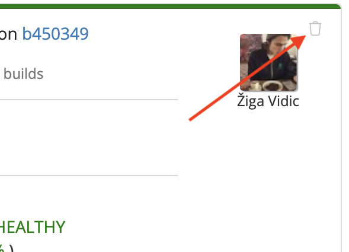

# Deploy cards

The deploy cards are a list of your deploys, shown in chronological order. Direct links are provided to the corresponding repos, allowing you to quickly see what changes were made for a given deploy. The size of the deploy is also displayed. Collectively, the size of your deploys over the displayed time range impacts the size graph. Clicking on the commit hash displays more detailed information about all the events leading up to the deploy. [Learn more](../resources/terminology.md#deploy-cards) about deploy cards. 

#### **By viewing a deploy card, you can:** 

* see who authored the deploy and how many PRs/commits/issues/files were in the deploy; 
* instantly view the pull request in whichever repository it resides in \([GitHub](../integrations-1/code-deployment/github.md) or [Bitbucket](../integrations-1/code-deployment/bitbucket.md), for example\);
* know when the deploy occurred; 
* get an objective, historical assessment of your project's health __\(_Unhealthy_, _Ailing_, _Healthy_, _Improved_\); and
* know how large or small of an impact the deploy had on your project overall. 

#### **To get more information about a deploy, you can:**

* Click on the card title to view all the PRs, commits, issues, files, impact and authors of the deploy; or
* Click on any of the PRs that comprised the deploy to view the deployed code in its corresponding repo.

#### Deleting deploys

You can delete a deploy by clicking the trash can icon in the upper-right corner of a deploy card \(see image below\). This action only deletes the deploy from Sleuth; the underlying data that comprises the deploy card are not affected \(e.g., code repos, feature flags, impact sources, files, etc.\). 


Sleuth updates all data displayed in the dashboard to account for any deleted deploys. For example, your leaderboard rankings are adjusted if you were the author of a deleted deploy. 


#### Searching deployment history

When searching through your deploy history using the search field, results are displayed as a list of deploy cards. Results are constrained by the selected report days and ending date \(shown below\). For example, if your reporting dates are constrained as a 7-day report ending on a day two months ago, your search results will only display deploy cards that both match the search criteria and the reporting dates. If you change the number of days or end date, you will need to re-enter your search terms. 

### Deploy card event icons

Sleuth uses a variety of event icons in the deploy cards to quickly and easily communicate the status of your deploys. You can hover over the icons to get more detailed information. The icons used are shown below: 

| Icon | Description | Meaning |
| :--- | :--- | :--- |
|   | **Commit** | A commit has been made to your code deployment. Comments made and hot-linked commit hash, along with the date and time, are also displayed.  |
|   | **Pull Request** | A pull request has been made on your code deployment. Comments made and hot-linked pull request number, along with the date and time, are also displayed.  |
|   | **Issue** | Issues submitted via configured issue tracker integrations are displayed. The issue name and number are displayed, along with issue creation date and time.  |
|   | **Build** | Build submitted via configured build services are displayed. The build name, hot-linked hash and results are displayed, along with build run date and time.  |
|   | **Success** | Your code has been deployed. Can be superseded by a new deploy \(see **Replaced** below\).  |
|   | **Soon** | Indicates that a deploy is coming soon. |
|   | **Replaced** | Indicates that the current deploy has been superseded by another deploy. If viewing a deploy card whose last event is not **Success** event, you can navigate to the next or previous deploy by clicking the _Next/Previous_ nav links:   |
|   | **Too Many** | Shown when there are too many event icons to display. Hovering over this icon will let you know how many icons are currently hidden.  |

