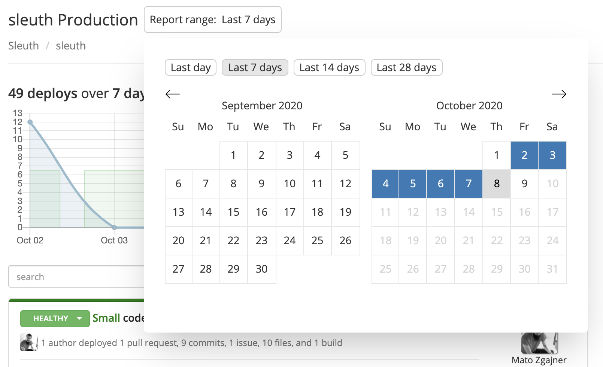

# Report date filter

The information displayed in the Dashboard by default reports the last 7 days of activity in the selected project. You can change the report scope by selecting a longer or shorter previous 7-day window, and also by changing the ending report date in the date picker. For convenience, dedicated buttons are provided for _Last day_, _Last 7 days_, _Last 14 days_, and _Last 28 days_. 

For **Growth** and **Enterprise** tiers, report retention data is unlimited; you can go back as far as you want. For the **Free** tier, retention data is limited to the previous 60 days.

All data displayed in the Dashboard reflect the date range selected in the filter, including the trend graph, deploy cards, and change sources. Additionally, the scope of any search is limited by the selected date range. Verify the selected date range if your searches aren't returning expected results. 

For example, if a deploy card from eight days ago contains the commit message "memory leak" and you pressed the _Last 7 days_ date range button, the deploy card will not show up in the search results for "memory leak," as the commit occurred outside of the selected date range. 

