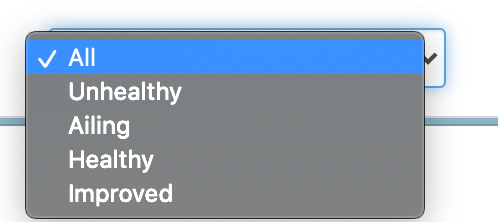

# Search

Search your entire deployment history using Sleuth's built-in search function. The search field features  search-as-you-type functionality; simply start typing and the [deploy cards](deploy-cards.md) that contain the entered search terms are displayed. 


You can also filter the deploy cards based on the health of the deploy. For example, you might only want to search deploys that were deemed _Unhealthy_. The dropdown value can be set either before or after you begin searching. 



Sleuth searches through all content contained in the Timeline, Pull Requests, Commits, Issues, Files, Builds, Impact, Authors, and Comments tabs, as shown in the detailed deploy card view \(shown below\). 


The trend graph, deploy size chart, and leaderboard will automatically update to reflect the results of your search. The date range displayed at the top of the trend graph will also update to reflect the range of the newest and oldest deploys, along with the total number of deploys, that contain your search terms.  

### Searching with Slack

If your organization has a Slack integration, you can search directly from the Slack app. You can search from any channel in the integrated organization. 

To search using Slack, type `/sleuth` then your search term. For example:

```text
/sleuth memory leak 
```

Search results are displayed in the same channel. The most recent 5 changes are returned. You can click the View all button to view all search results. This will open up a new browser window, launch the Sleuth app, and display the search results. 


By default `/sleuth MY SEARCH TEXT` will search all projects in the organization with the Slack integration for matching deploys. You can also use the `/sleuth create My manual change #with_tags` command to create [manual changes](https://help.sleuth.io/integrations-1/manual-changes).

