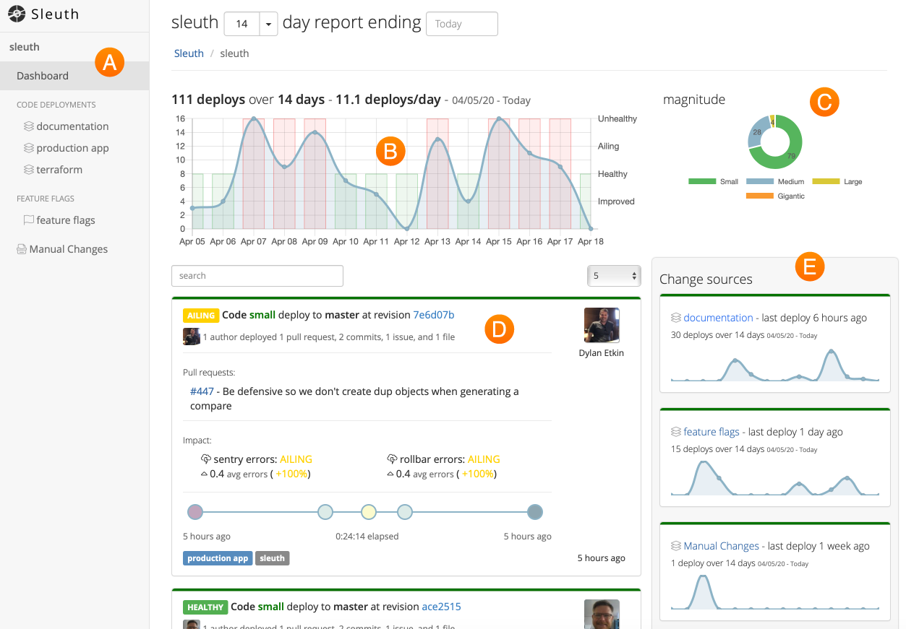

# Dashboard

The Dashboard is the singular pane-of-glass view into your project, providing you with a comprehensive overview of code deployments, feature flags, impact, and all integrations.

You can take a look at the Sleuth development team's [Dashboard](https://app.sleuth.io/sleuth/sleuth) right now.

Let's take a quick look at some of the elements in the Dashboard:

**Item A: Sidebar**

The Sidebar provides quick access to your projects \(if you have more than one\), code deployments, feature flags, and impacts.

**Item B: Trend Graph**

A visual representation of the changes that have have been made over the selected time range.

**Item C: Magnitude**

This graph gives you a quick way to gauge the overall scope of your deployed changes.

**Item D: Deploys**

A running list of your deploys, shown in chronological order. Direct links are provided to the corresponding repos, allowing you to quickly see what changes were made. The magnitude of the deploy is displayed. Collectively, the magnitude of your deploys over the displayed time range impacts the magnitude graph.

