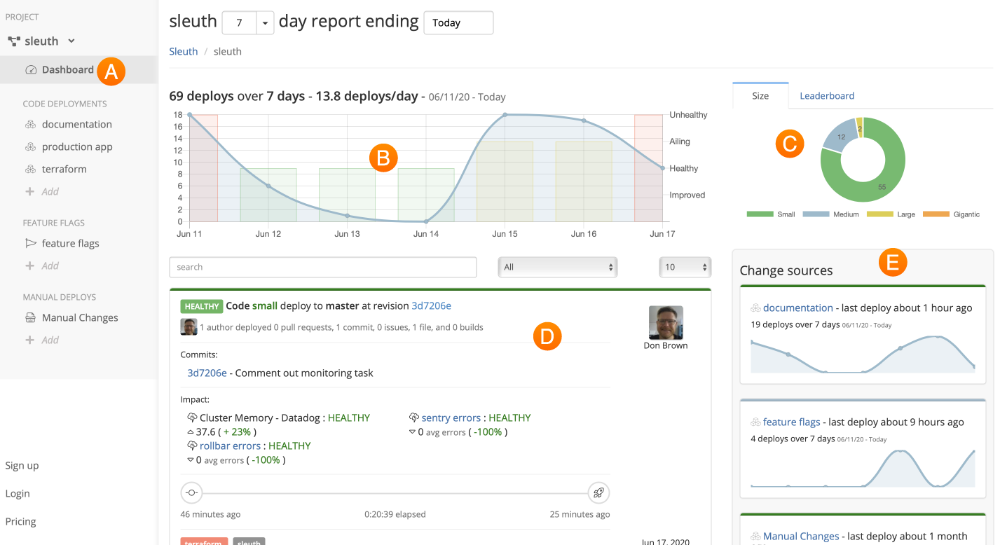

# Dashboard

The **Dashboard** is Sleuth's command central, where all of the data your disparate tools generate are aggregated and presented to you in a clean, easy-to-use interface. 

All the data Sleuth collects about your code deployments is displayed in the Dashboard. The Dashboard is composed of the following elements: 

* **Sidebar** 🇦 

  The Sidebar provides quick access to your projects \(if you have more than one\), code deployments, feature flags, impact sources, and integrations, along with organization and project settings. 

* **Trend graph** 🇧 

  A visual representation of the impact of your deploys that have have been made over the selected time range shown in the data picker above the graph.

* **Size/Leaderboard** 🇨 

  The [**Size**](resources/terminology.md#size) graph provides a visual representation of the size of your deployments. The [**Leaderboard**](resources/terminology.md#leaderboard) gamifies deployment cadence, motivating you and your peers to deploy faster and more frequently. 

* **Deploy card** 🇩 

  A running list of deploys, shown in chronological order. Direct links are provided to the corresponding repos, allowing you to quickly see what changes were made, who authored the changes, etc. Deploy size is also displayed. Collectively, the size of your deploys over the displayed time range impacts the **Size** graph. Clicking on the commit hash displays more details about the events leading up to the deploy. [Learn more](resources/terminology.md#deploy-cards) about **deploy cards**. 

* **Change sources** 🇪 All of the sources of change connected to your project are displayed here. Collectively, all of the change sources combined drive the data shown in the main **trend graph**🇧.

