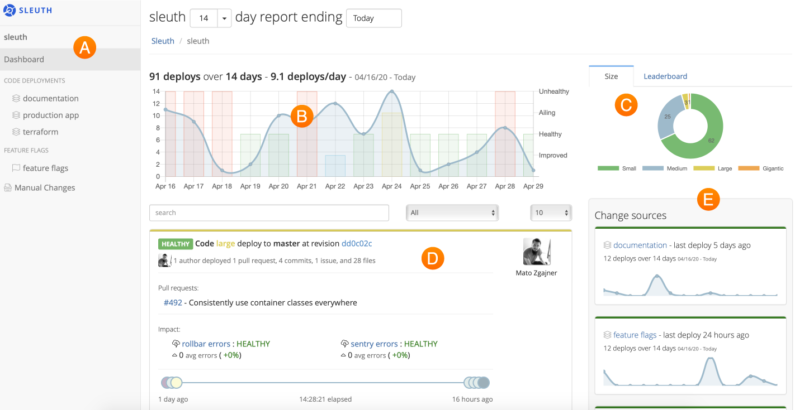

# Dashboard

The **Dashboard** is Sleuth's command central, the single pane of glass through which you view your entire DevOps stack. Sleuth aggregates all of the data your disparate tools generate and presents it to you in a clean, easy-to-use interface. 

All the data Sleuth collects about your code deployments is displayed in the Dashboard. The Dashboard is composed of the following elements: 

* \*\*\*\*[**Sidebar**](sidebar.md) ****🇦 
* \*\*\*\*[**Trend graph**](trend-graph.md) ****🇧 
* \*\*\*\*[**Size/Leaderboard**](size-leaderboard.md) ****🇨 
* \*\*\*\*[**Deploy card**](deploy-card.md) ****🇩  
* \*\*\*\*[**Change sources**](change-sources.md) 🇪
* [**Report date filter**](report-date-filter.md)\*\*\*\*
* [**Deploy previews**](deploy-previews.md)\*\*\*\*

