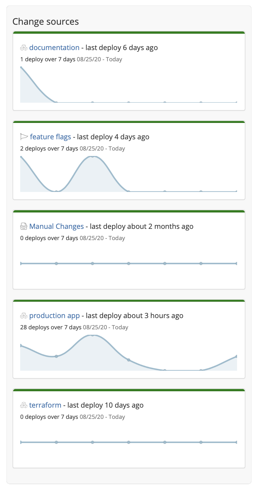

# Change sources

All of the sources of change connected to your project are displayed here. These change sources include code deplopyments, feature flags, and manual changes. Collectively, all of the change sources combined drive the data shown in the [trend graph](trend-graph.md).

The graph displayed in each change source is confined to the 

