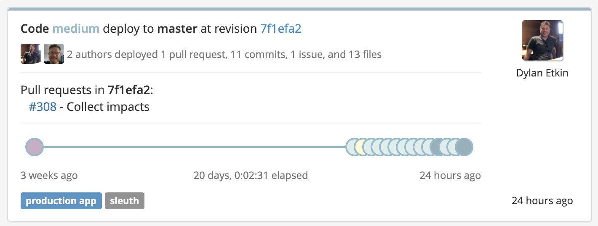

# Deploy card

The deploy cards are a running list of your deploys, shown in chronological order. Direct links are provided to the corresponding repos, allowing you to quickly see what changes were made. The size of the deploy is also displayed. Collectively, the size of your deploys over the displayed time range impacts the size graph. Clicking on the commit hash displays more detailed information about all the events leading up to the deploy. [Learn more](../resources/terminology.md#deploy-cards) about deploy cards. 

By viewing a deploy card, you can: 

* see who authored the deploy and how many PRs/commits/issues/files were in the deploy; 
* instantly view the pull request in whichever repository it resides in \([GitHub](../integrations-1/change-sources/code-deployment/github.md) or [Bitbucket](../integrations-1/change-sources/code-deployment/bitbucket.md), for example\);
* know when the deploy occurred; 
* get an objective, historical assessment of your project's health __\(_Unhealthy_, _Ailing_, _Healthy_, _Improved_\); and
* know how large or small of an impact the deploy had on your project overall. 

To get more information about a deploy, you can:

* Click on the card title to view all the PRs, commits, issues, files, impact and authors of the deploy; or
* Click on any of the PRs that comprised the deploy to view the deployed code in its corresponding repo.

### Deploy card icons

Sleuth uses a variety of icons in the deploy cards to quickly and easily communicate the status of your deploys. You can hover over the icons to get more detailed information. The icons used are as follows: 

* COMMIT: 'code-commit'
* PULL\_REQUEST: 'code-merge'
* ISSUE: 'clipboard-check'
* BUILD: 'hammer'
* SUCCESS: 'rocket-launch'
* SOON: 'atom'
* REPLACED: 'sync-alt'
* TOO\_MANY: 'tasks'

