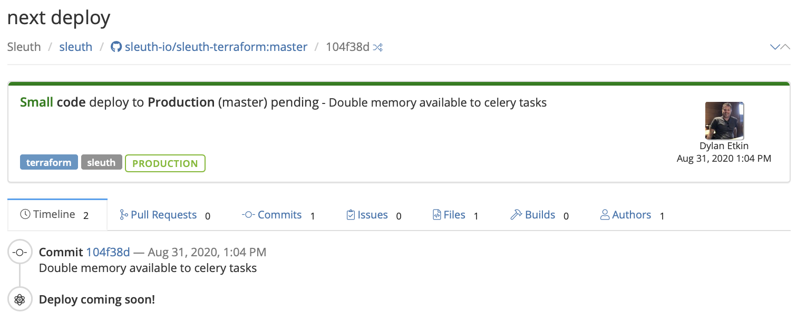
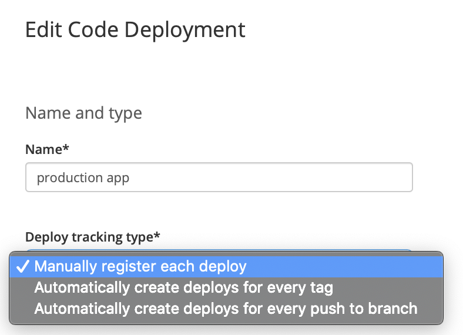
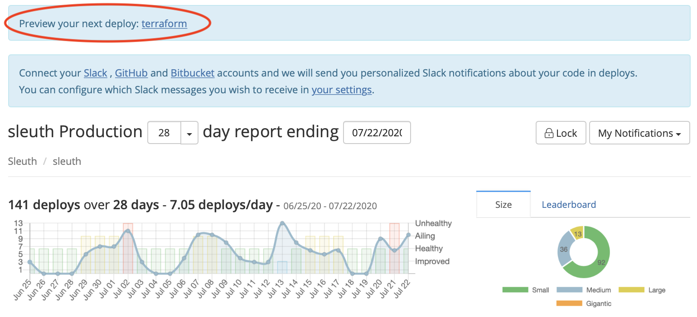

# Deploy previews

Sleuth can automatically preview your next deploy in your project and environment by displaying a comprehensive list of resources that will be deployed to your configured code repositories. The information displayed is similar to the information displayed in a [deploy card](deploy-card.md). 

To use deploy previews a code deployment must have _Manually register each deploy_ selected in **Deploy tracking type**, as shown below. 

Creating deploys automatically for every tag or push to branch does not give Sleuth the time it needs to preview your deploys; by manually registering each deploy, Sleuth will provide a preview up until the moment your code is deployed. 


As an example, let's say you make commits, A, B, C, and D, but only manually notified Sleuth that A was deployed. In this case, your master branch's current version is A, while B, C, and D have yet to deployed. Sleuth will then preview commits B, C, and D, then notify you that a preview exists for the corresponding code deployment in your project. 


