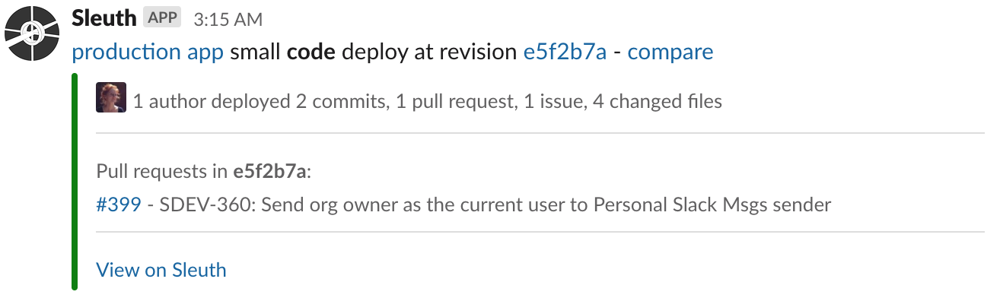
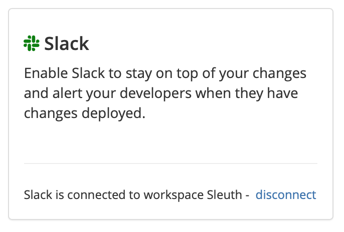

# Slack

### About the Integration  

Keep your teams and other principals informed throughout the entire CI/CD lifecycle by using Slack as your main communication channel. No more bloated distribution lists, and bombarding your team with a barrage of emails. Use Slack's powerful communications features to keep development teams informed about your code deploys, and your entire organization up to date on progress.

Agile teams will spend most of their time viewing the Sleuth [Dashboard](../) to get the granular detail they need to stay informed on the status of deploys, impact, magnitude, and the breadth and scope of information Sleuth provides. Other members of your organization, however, might only want a quick update on your team's progress without getting in the weeds; the Big Picture view🖼. Slack messages provide just that—automated, easily-digestable messages where they can view: 

* when your deploy occurred; 
* what was deployed; 
* who the author was;
* how big the deploy was; 
* the commit hash; 
* how many commits, PRs, issues, and changes were in the deploy; 
* any [Jira](jira.md) issues associated with the deploy; and
* a link to the Sleuth deploy card, where even more information is available.  


A [Jira integration](jira.md) is required to view associated Jira issues within automated Slack messages from Sleuth.  


Before you start, you should already have a Slack account. Additionally, you should create channels that you plan to use for messaging in Slack before setting up the integration in Sleuth. Sleuth will ask for the Slack channel where it should send its messages to. You can have as many channels as needed. You might have different audiences, who might have different needs. Your developers might want a channel that communicates every deploy; your CTO, on the other hand, might want a quieter channel that only communicates Unhealthy deploys, which could signal a problem. But no news is good news, right? 📰 


Don't forget to set the security on your Slack channels, to either Public or Private. If you select Private, you will need to invite the Sleuth "bot" to the channel first. 


To add the Slack integration:

* Click **Integrations** in the sidebar.
* Click **connect** in the Slack Chat Ops card. 


You must add Sleuth as an Authorized Application in Slack.  
For more information, [read the Slack documentation](https://api.slack.com).


* The Slack logo in the Change Source card will turn green when the integration is successful. 

* The Slack integration is done at the Organization level. Since multiple Projects can exist within an Organization, you'll want to go in to each Project and configure notifications individually.  Create your Slack channels first before configuring the notifications in the Sleuth Projects; you can't create a new channel from Sleuth if it doesn't yet exist within Slack. 


Click **disconnect** to dissolve the Sleuth-Slack integration. You will need to re-authorize Sleuth again if you wish to re-establish the integration.


* Sleuth will now use Slack to relay important deploy information to your team. 

  
****

