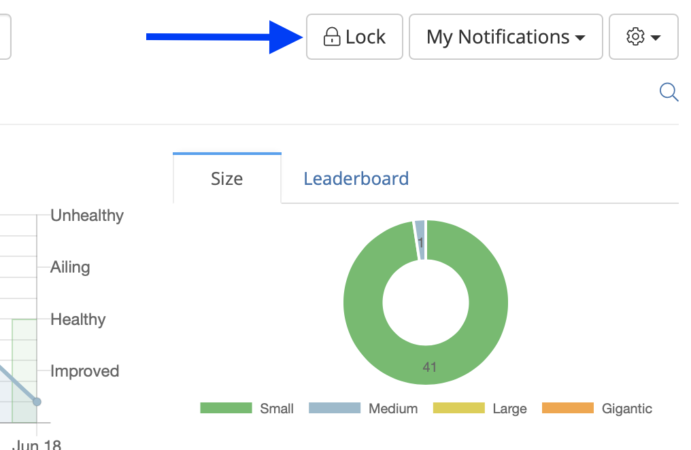
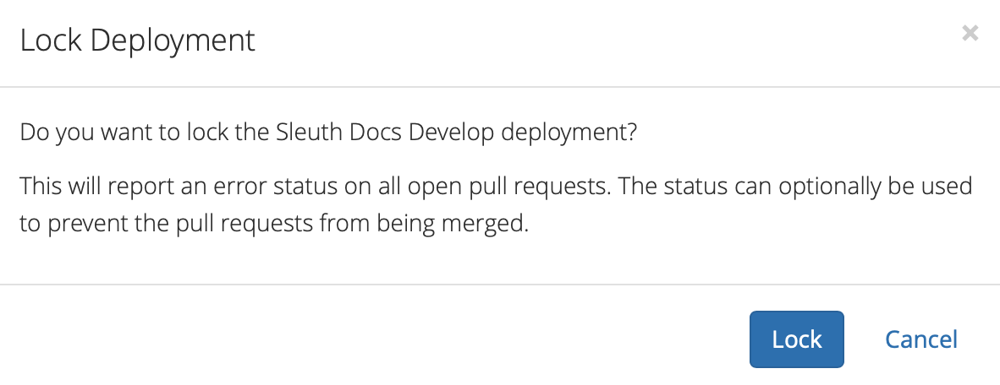

# Locking repos

There will be times where you'll need to lock a repo, and there are various reasons for doing so. We don't need to get in the _Whys_ of why you need to lock a repo, but _When_ it does happen, here is _What_ you do: 

1. Go to the Dashboard. 
2. Click **Lock**. 
3. Press **Lock** to lock the repo, or **Cancel** to exit without making any changes. 

