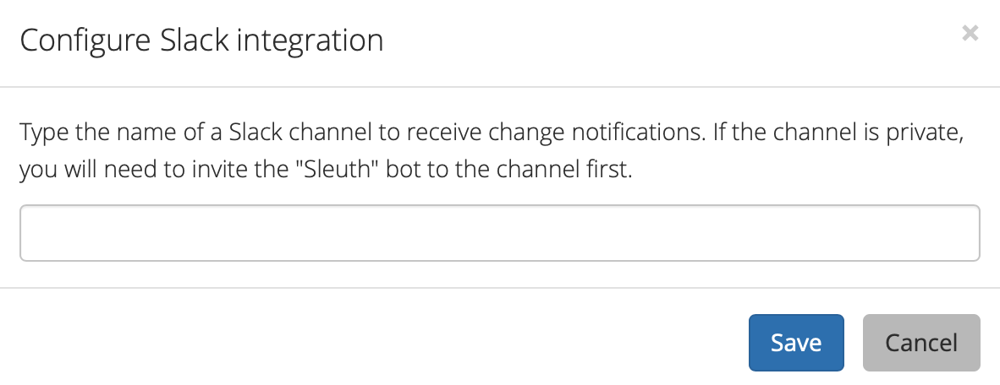

# Notifications

Configure the Slack notifications for your project by selecting **Configure Slack integration**. This will display the integration dialog: 

Enter the name of the Slack channel that will receive messages generated by the project. 


The Slack integration is applied to your organization in Sleuth. Configure granular Slack notifications at the project level. Remember, multiple projects can belong to the same organization, and those projects can fire Slack notifications individually and to specific channels. **This is a key feature in Sleuth and for your remote teams**: not every person in your organization wants to know what's going on within and across every project. 


