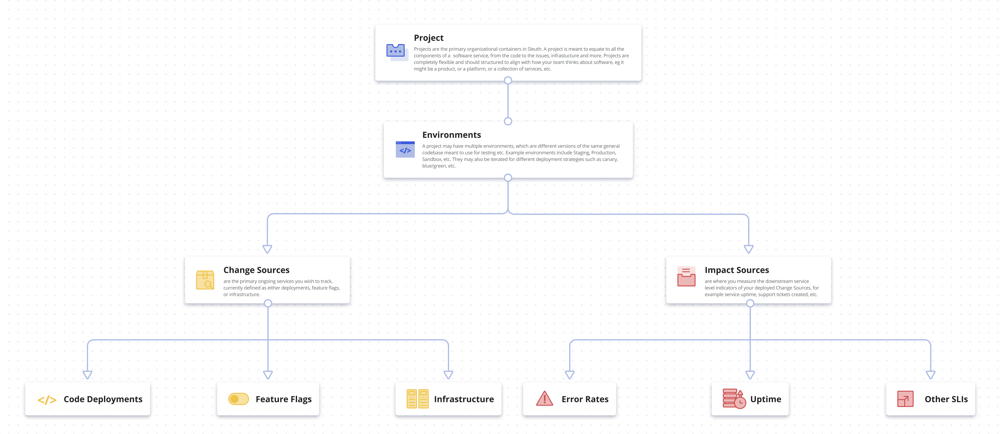
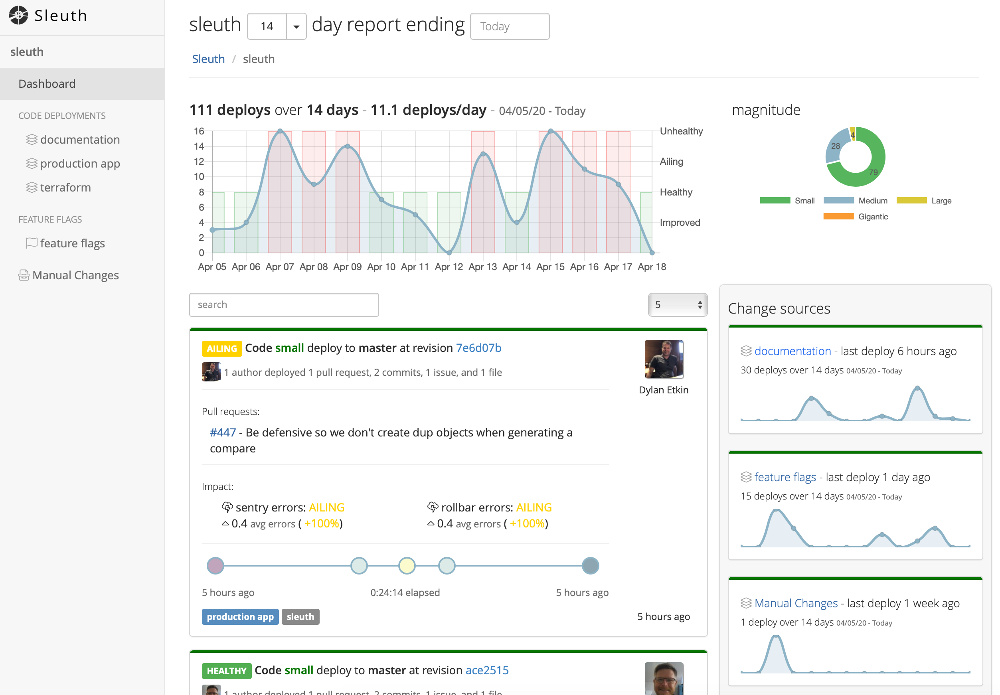
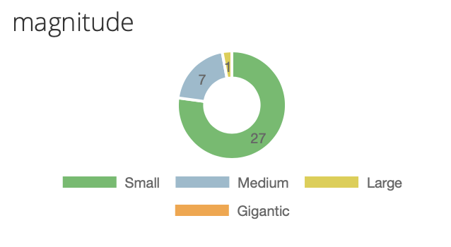

# Getting started

## Sleuth Information Architecture

Sleuth can help you track the health and status of your deploys by providing a single of pane of glass through which you can view all of your change and impact sources. The Sleuth information architecture terms should already be familiar to you, since we use industry-standard CI/CD nomenclature \(_check out_ [_**Terminology**_](terminology.md) _for more information_\). 

In Sleuth you create a **Project** container, which houses all the necessary **Environments** your team might need to create, develop and test your applications. These Enviroments might include production, staging, development, and could even account for different deployment strategies such as canary, blue/green, etc. 

Once you've created and configured the various Environments within your Project, you can start adding connections to your **Change Sources** and **Impact Sources** \(see [Integrations](integrations/) for more information on connecting Change Sources and Impact Sources\). 

Sleuth tracks Change Sources, such as **Code Deployments**, **Feature Flags**, and **Infrastructure**, and constantly analyzes the information they contain to capture the state of your code before, during, and after deploys. Additionally, Sleuth intakes information provided by various Impact Sources, such as **Error Rates**, **Uptime**, and **Other SLIs**. 

## Dashboard

Combining Impact Source information with Change Source data is what drives the information you see on the Sleuth [**Dashboard**](dashboard.md). 

You can instantly see the impact of your deploys on your entire project environment over a period of time by viewing the Trend Graph; for detailed information on individual deploys you can view a deploy card \(see below\). 


You can view a live version of the Sleuth Dashboard at [https://app.sleuth.io/sleuth/sleuth](https://app.sleuth.io/sleuth/sleuth).   
It's what the Sleuth team uses everyday to make **awesome**! ✨ 


### Deploy cards

By viewing a deploy card, you can: 

* see who authored the deploy and how many PRs/commits/issues/files were in the deploy; 
* instantly view the pull request in whichever repository it resides in \([GitHub](integrations/github.md) or [Bitbucket](integrations/bitbucket.md), for example\);
* know when the deploy occurred; 
* get an objective, historical assessment of your project's health __\(_Unhealthy_, _Ailing_, _Healthy_, _Improved_\); and
* know how large or small of an impact the deploy had on your project overall. 

To get more information about a deploy, you can:

* Click on the card title to view all the PRs, commits, issues, files, impact and authors of the deploy; or
* Click on any of the PRs that comprised the deploy to view the deployed code in its corresponding repo.

### Magnitude

Another significant metric assessment Sleuth provides is **Magnitude**. The Magnitude chart shows you how many large versus small deploys you have committed to your repos \(changes can be _Small_, _Medium_, _Large_, or _Gigantic_\). Since the overall goal of solid CI/CD practice is to deploy small and deploy often, the Magnitude chart gives you instant insight into whether you're _continuously deploying_ small, effective changes to your repositories instead of occasional _gigantic_, unstable changes, which could prove problematic if a rollback is necessary when a change proves fatal to your application. 

## Slack notifications

You and your team can stay informed of your Project's status by connecting the [Slack integration](integrations/slack.md). By taking advantage of Slack's powerful team messaging features, you and your team can be notified when anything goes wrong, or when you just want to get an update that a deploy was successful. 

Both team and one-to-one notifications can be configured in Slack. For example, your development team might want a notification on every deploy, but a product manager or CTO might only want a weekly digest or be notified only when there's an issue that might affect a release deadline. 

## Let's get you started! 

If you haven't already signed up for a Sleuth account, [you'll need to do that first](./). Otherwise, let's continue by connecting Sleuth to a code repo. 

 



#### Go to the Sleuth [Dashboard](dashboard.md)




#### Select _**Create**_, then _**Create project**_




#### Add a name and description for your project




#### Connect integrations

* Connect [GitHub](integrations/github.md), [Bitbucket](integrations/bitbucket.md) and [LaunchDarkly](integrations/launchdarkly.md) change source integrations; [Slack](integrations/slack.md) ChatOps integrations; and [Jira](integrations/jira.md) and [Clubhouse](integrations/clubhouse.md) issue tracking integrations. 
* Enable GitHub or Bitbucket to track deploys made via your code repositories. See pull requests, commits, authors and issues associated with every deploy.
* Enable LaunchDarkly to track changes made via your feature flags. Associate your flag changes with your code deployments.
* Enable Slack to stay on top of your changes and alert your DevOps team members when changes have been deployed.
* Enable Jira or Clubhouse to track the issues and epics you are deploying to your users



#### Invite team members

You can add existing members to your organization or add the email address of someone you'd like to have invited to join your organization. If the invitation's accepted, the user will automatically be added to your organization. 

You can also configure your organization so that anyone signing up with an email from your company's domain will automatically join your organization without any additional action needed.



#### Add change source

* See commits, issues, pull requests, changed files and authors for every deploy.
* Quickly see when you've rolled out code and exactly what's changed to help squash bugs.
* Release notes sent to your Slack team channels.
* See an aggregate of what's been deployed today, this week or this month.
* Allow everyone in your organization to understand what code changes you're shipping.

#### 💥 You're ready! 

You can now start seeing your code in [the Sleuth Dashboard](dashboard.md). Happy deploying! 



