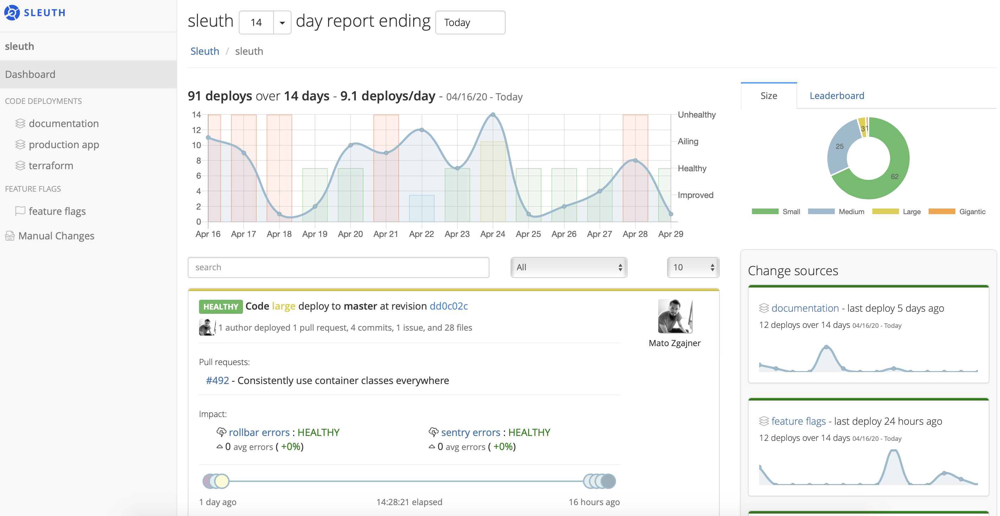
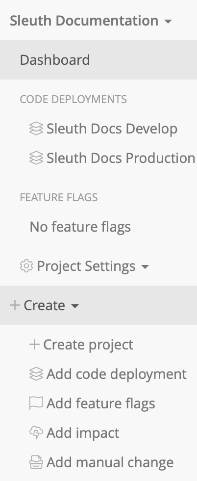
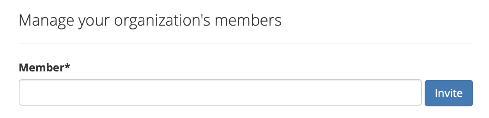

# Getting started

It only takes a few minutes to connect Sleuth to a change source and start analyzing the health of your code. 

A change source can be a code deployment on Bitbucket, GitHub or GitLab; feature flags on LaunchDarkly; or issues on Clubhouse or Jira, with [many other integrations](integrations-1/about-integrations....md) available. 

To get started with Sleuth: 

* **Create an account.** You can use an email address or connect via SSO thru Google, GitHub or Bitbucket. Read [Signing up](getting-started.md) for more information. 
* **Name your project.** You can also add a description, which is optional. 
* **Add a change source.** This can be a code deployment on [GitHub](integrations-1/change-sources/code-deployment/github.md), feature flags on [LaunchDarkly](integrations-1/change-sources/feature-flags/launchdarkly.md), issues from [Jira](integrations-1/issue-trackers/jira.md), or the many [other available integrations](integrations-1/about-integrations....md). 
* **Add an integration.** An integration can be change sources, chat ops, issue trackers, and error and metric trackers. Make sure you have access credentials for any integration you want to connect.  

For a more detailed walkthrough of the setup process, click through the tabs below: 



#### Go to the Sleuth [Dashboard](dashboard/)




#### Select _**Create**_, then _**Create project**_




#### Add a name and description for your project




#### Connect integrations

* Connect [GitHub](integrations-1/change-sources/code-deployment/github.md), [Bitbucket](integrations-1/change-sources/code-deployment/bitbucket.md) and [LaunchDarkly](integrations-1/change-sources/feature-flags/launchdarkly.md) change source integrations; [Slack](integrations-1/chat-ops/slack.md) ChatOps integrations; and [Jira](integrations-1/issue-trackers/jira.md) and [Clubhouse](integrations-1/issue-trackers/clubhouse.md) issue tracking integrations. 
* Enable GitHub or Bitbucket to track deploys made via your code repositories. See pull requests, commits, authors and issues associated with every deploy.
* Enable LaunchDarkly to track changes made via your feature flags. Associate your flag changes with your code deployments.
* Enable Slack to stay on top of your changes and alert your DevOps team members when changes have been deployed.
* Enable Jira or Clubhouse to track the issues and epics you are deploying to your users



#### Invite team members

If you're part of an organization that has already set up a Sleuth environment and your email address uses the same domain, integrations might already be connected to your organization. In these cases, you won't need to add the integration yourself. 

You can add existing members to your organization or add the email address of someone you'd like to have invited to join your organization. If the invitation's accepted, the user will automatically be added to your organization. 



#### Add change sources

* See commits, issues, pull requests, changed files and authors for every deploy.
* Quickly see when you've rolled out code and exactly what's changed to help squash bugs.
* Release notes sent to your Slack team channels.
* See an aggregate of what's been deployed today, this week or this month.
* Allow everyone in your organization to understand what code changes you're shipping.

#### 💥 You're ready! 

You can now start seeing the impact of your changes in [the Sleuth Dashboard](dashboard/). Happy deploying! 



