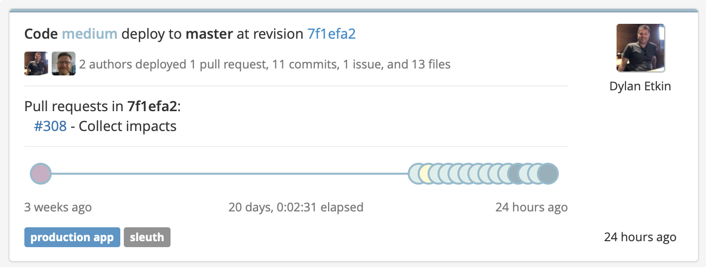
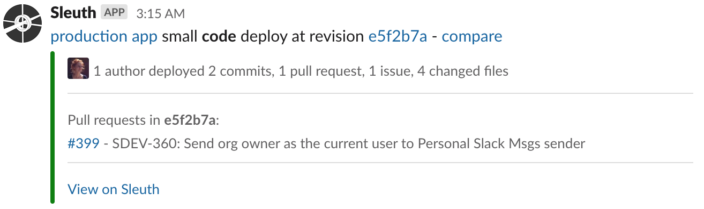

# Getting started

## Information Architecture

Sleuth can help you track the health and status of your deploys by providing a single of pane of glass through which you can view all of your change and impact sources. 


In Sleuth you create a **Project** container, which houses all the necessary **Environments** your team might need to create, develop and test your applications. These Enviroments might include production, staging, development, and could even account for different deployment strategies such as canary, blue/green, etc. 

Once you've created and configured the various Environments within your Project, you can start adding connections to your **Change Sources** and **Impact Sources** \(see [Integrations](integrations/) for more information on connecting Change Sources and Impact Sources\). 

Sleuth tracks Change Sources, such as **Code Deployments**, **Feature Flags**, and **Infrastructure**, and constantly analyzes the information they contain to capture the state of your code before, during, and after deploys. Additionally, Sleuth intakes information provided by various Impact Sources, such as **Error Rates**, **Uptime**, and **Other SLIs**. 

## Dashboard

Combining Impact Source information with Change Source data is what drives the information you see on the Sleuth [**Dashboard**](dashboard/). 


You can instantly see the impact of your deploys on your entire project environment over a period of time by viewing the Trend Graph; for detailed information on individual deploys you can view a deploy card \(see below\). 

### Deploy cards

By viewing a deploy card, you can: 

* see who authored the deploy and how many PRs/commits/issues/files were in the deploy; 
* instantly view the pull request in whichever repository it resides in \([GitHub](integrations/github.md) or [Bitbucket](integrations/bitbucket.md), for example\);
* know when the deploy occurred; 
* get an objective, historical assesment of your project's health __\(_Unhealthy_, _Ailing_, _Healthy_, _Improved_\); and
* know how large of an impact the deploy had on your project overall. 




### Magnitude

Another significant metric assessment Sleuth provides is **Magnitude**. The Magnitude chart shows you how many large versus small deploys you have committed to your repos. Since the overall goal of solid CI/CD practice is to deploy small and deploy often, the Magnitude chart gives you instant insight into whether you're _continuously deploying_ small, effective changes to your repositories instead of occasional _gigantic_, unstable changes, which could prove problematic if a rollback is necessary if the change proves fatal to your application. 

### Slack notifications

You and your team can stay informed of your Project's status by connecting the [Slack integration](integrations/slack.md). By taking advantage of Slack's powerful team messaging features, you and your team can be notified when anything goes wrong, or when you just want to get an update that a deploy was successful. 

Both team and one-to-one notifications can be configured in Slack. For example, your development team might want a notification on every deploy, but a product manager or CTO might only want a weekly digest or be notified only when there's an issue that might affect a release deadline. 



## Let's get you connected! 

If you haven't already signed up for a Sleuth account, [you'll need to do that first](./). Otherwise, let's continue by connecting Sleuth to a code repo: 

1. Go to the Sleuth [Dashboard](dashboard/). 
2. Select **Create**, then **Create project**.  

```
$ 
```


 


```bash

```


