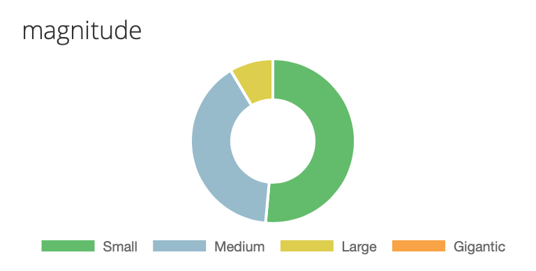

# Glossary

#### Magnitude

#### Change source

#### **Organizations**

#### **Projects**

Projects contain **change sources**:

#### **Code deployments**

Code deployments track deploys. Deploys collect the code changes, pull requests, issues, and authors deploying to your environment. 

Code deployments also: 

* capture the code reviews in each deploy;
* generate ChatOps notifications of deploys;
* preview what changes a deploy will contain.

#### **Feature flags**

#### **Infrastructure changes**

Projects contain **impact sources:**

* **Error rates**
* **SLIs**
* **Response times**

**Integrations**

**Environments**

* Staging
* Production

