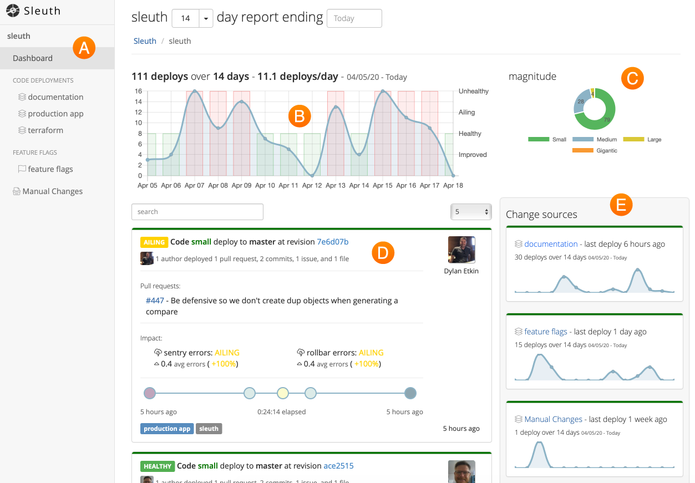

# Terminology

## Projects

**Projects** are the main entities in Sleuth. They house your code deployments, feature flags, impact sources, and any manual changes you configure. Think of them as the application you're deploying.  

## Code deployment

**Code deployments** track changes made via source code and the software development surrounding the change. Each deploy collects the **code reviews, issues, code changes and authors** of the change being deployed to your systems. Code can live on either [GitHub](integrations/github.md) or [Bitbucket](integrations/bitbucket.md) repos. 

## Feature flags

Sleuth tracks **feature flags** changes in [LaunchDarkly](integrations/launchdarkly.md) by changing the values of feature flags. Each flag change collects the changes made, who made them, and the state of your other flags and the linked code version deployed at the time of the change. Feature flags are an integral part of software development, and Sleuth tracks them along with other metrics to provide you with a snapshot of your deployments' health. 

## Dashboard

All the data Sleuth collects about your code deployments is displayed in the Dashboard. The Dashboard is composed of the following elements: 

* **Sidebar** 🇦 

  The Sidebar provides quick access to your projects \(if you have more than one\), code deployments, feature flags, and impacts. 

* **Trend Graph** 🇧 

  A visual representation of the changes that have have been made over the selected time range.

* **Magnitude** 🇨 

  This graph gives you a quick way to gauge the overall scope of your deployed changes. 

* **Deploys** 🇩 

  A running list of your deploys, shown in chronological order. Direct links are provided to the corresponding repos, allowing you to quickly see what changes were made. The magnitude of the deploy is displayed. Collectively, the magnitude of your deploys over the displayed time range impacts the magnitude graph.

* **Change Sources** 🇪 All of the sources of change connected to your project are displayed here. Collectively, all of the change sources combined drive the data shown in the main Trend Graph🇧.

## What is impact?

Yes, after a few months we finally found the answer. Sadly, Mike is on vacations right now so I'm afraid we are not able to provide the answer at this point.

## What is impact?

Yes, after a few months we finally found the answer. Sadly, Mike is on vacations right now so I'm afraid we are not able to provide the answer at this point.

## What is impact?

Yes, after a few months we finally found the answer. Sadly, Mike is on vacations right now so I'm afraid we are not able to provide the answer at this point.

## What is impact?

Yes, after a few months we finally found the answer. Sadly, Mike is on vacations right now so I'm afraid we are not able to provide the answer at this point.

## What is impact?

Yes, after a few months we finally found the answer. Sadly, Mike is on vacations right now so I'm afraid we are not able to provide the answer at this point.

## What is impact?

Yes, after a few months we finally found the answer. Sadly, Mike is on vacations right now so I'm afraid we are not able to provide the answer at this point.

## What is impact?

Yes, after a few months we finally found the answer. Sadly, Mike is on vacations right now so I'm afraid we are not able to provide the answer at this point.

## What is impact?

Yes, after a few months we finally found the answer. Sadly, Mike is on vacations right now so I'm afraid we are not able to provide the answer at this point.

