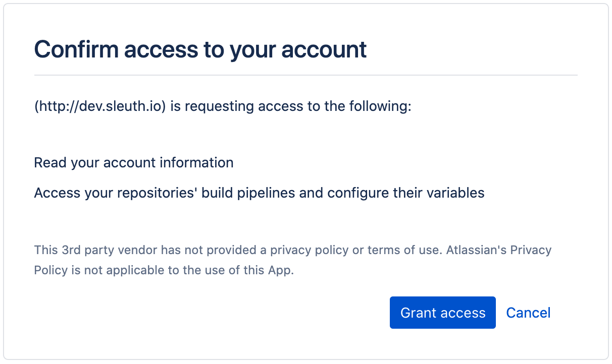
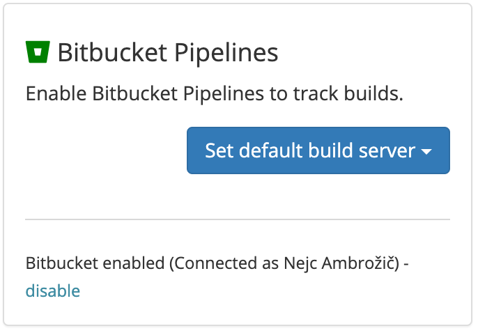

# Bitbucket Pipelines

## About the integration

The Bitbucket pipelines integration provides Sleuth with the ability to track your pipelines and associate them with your corresponding Sleuth deploys. Once configured, the integration silently monitors your deployment activity, and ties your Bitbucket pipelines with associated deployments you make to your integrated change sources by matching the git SHAs from your code repos. Sleuth then shows you a snapshot of your build state at the time of deploy. 

## Setting up the integration

To set up the Sleuth Bitbucket Pipelines integration: 

1. Click **Integrations** in the left sidebar, then click **Builds**. 
2. In the _Bitbucket_ tile, click **enable**. 
3. You must grant Sleuth access to your Bitbucket account by clicking **Grant access** in the confirmation dialog.   
4. On successful integration, you'll see **Bitbucket enabled \(Connected as** _**&lt;Bitbucket user account&gt;**_**\)** displayed in the Bitbucket Pipelines tile.

## Configuring the integration

To configure the Bitbucket Pipelines integration, you will need to set a default build server: 

1. Click **Integrations** in the sidebar, then click the **Builds** tab. 
2. Click the **Set default build server** dropdown.    
3. Select a project to set as the default build server. You'll need to add a code deployment to the selected project if you haven't already done so. 

Now that the Bitbucket Pipelines integration is configured, you will begin seeing information displayed in the Builds tab of a [deploy](../../modeling-your-deployments/deploy-cards.md).

