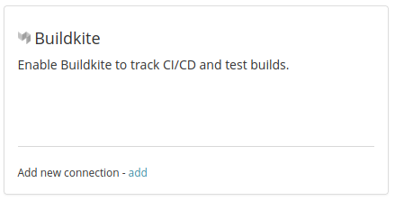
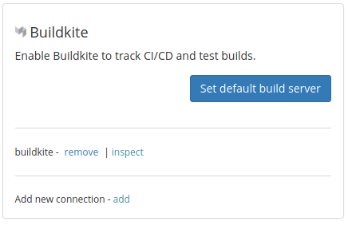
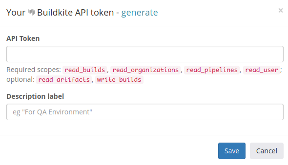
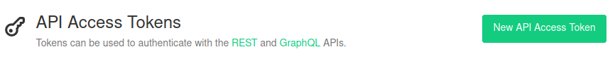
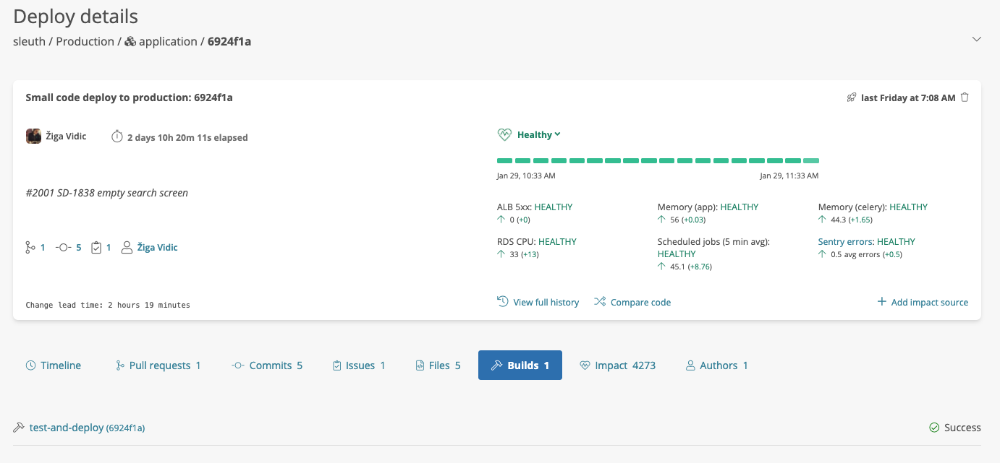

# Buildkite

## About the integration

The Buildkite integration provides Sleuth with the ability to track your Buildkite builds and associate them with your corresponding Sleuth deploys. Once configured, the Sleuth Buildkite integration silently monitors your deployment activity, and ties your Buildkite builds with associated deployments you make to your integrated change sources by matching the git SHAs from your code repos. Sleuth then shows you a snapshot of your build state at the time of deploy. 

## Setting up the integration

To add the Sleuth Buildkite integration:

1. Click **Integrations** in the sidebar.
2. Click the** CI/CD** tab, then click **enable** in the Buildkite card. \
     
3. Enter your Buildkite User API Token, then press **Save**. To quickly obtain your User API Token, make sure you're logged in to your Buildkite account, then click **generate**. You will be taken to the Personal API Tokens section of your Buildkite account. 
4. On successful integration, you'll see a new connection you can remove or inspect. You'll  configure 
   the default build server later. \
   

You can create multiple connections and choose which connection is relevant for each usage.


[Read the Buildkite documentation](https://buildkite.com/docs/apis/managing-api-tokens) for more information on generating Personal API Tokens. 


## Configuring the integration

The Sleuth Buildkite integration configuration simply consists of pointing the Buildkite integration to your projects that you want Sleuth to collect build information for. 

To configure the Buildkite integration, you will need to set a default build server: 

1. Click **Integrations** in the sidebar, then click the **Builds** tab. 
2. Click the **Set default build server** dropdown. \
     
3. Select a project to set as the default build server. You'll need to add a code deployment to the selected project if you haven't already done so. 

Now that the Buildkite integration is configured, you will begin seeing information displayed in the Builds tab of a [deploy](../../modeling-your-deployments/deploy-cards.md), as shown below. 

## Removing the integration

#### If you wish to disconnect the Buildkite integration for the organization: 

1. Click on **Integrations** in the left sidebar, then on **Builds**. 
2. In the Buildkite integration card, click **remove**.

If there are no more active connections, the Buildkite integration is disconnected and no longer available to any 
projects within that organization.
