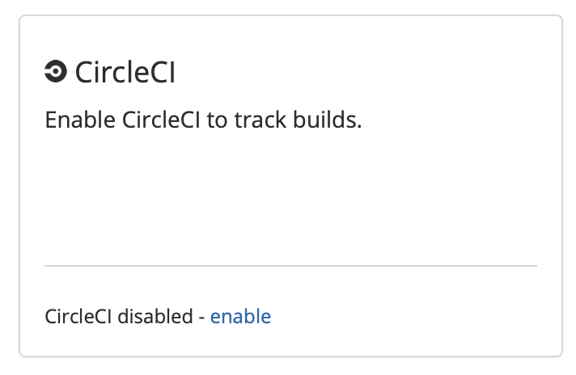
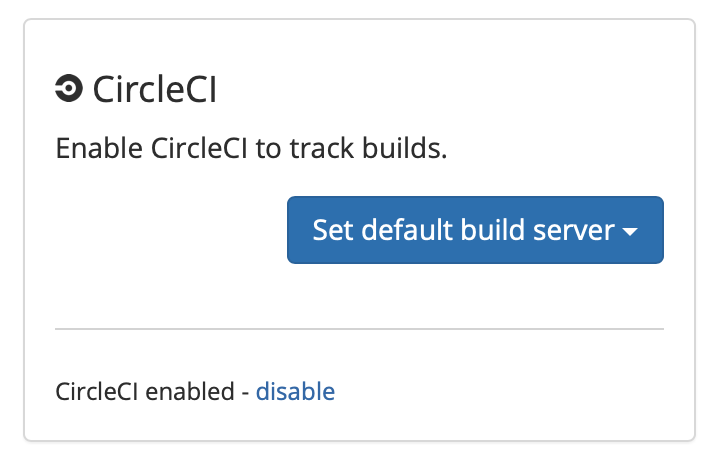
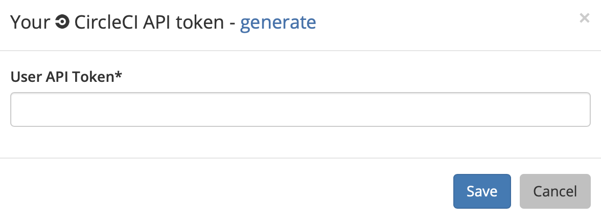
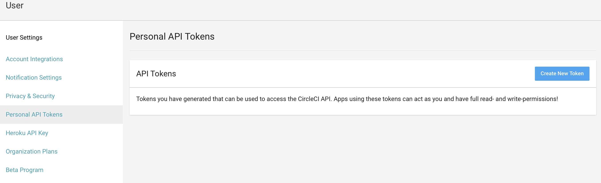
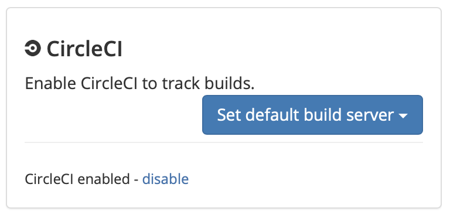

# CircleCI

## About the integration

The CircleCI integration provides Sleuth with the ability to track your CircleCI builds and associate them with your corresponding Sleuth deploys. Once configured, the Sleuth CircleCI integration silently monitors your deployment activity, and ties your CircleCI builds with associated deployments you make to your integrated change sources by matching the git SHAs from your code repos. Sleuth then shows you a snapshot of your build state at the time of deploy. 

## Setting up the integration

To add the Sleuth CircleCI integration:

1. Click **Integrations** in the sidebar.
2. Click the **Builds** tab, then click **enable** in the CircleCI card.    
3. Enter your CircleCI User API Token, then press **Save**. To quickly obtain your User API Token, make sure you're logged in to your CircleCI account, then click **generate**. You will be taken to the Personal API Tokens section of your CircleCI account. 
4. On successful integration, you'll see **CircleCI enabled** displayed in the CircleCI tile. You'll  configure the default build server later.   


[Read the CircleCI documentation](https://circleci.com/docs/2.0/managing-api-tokens/#creating-a-personal-api-token) for more information on generating Personal API Tokens. 


## Configuring the integration

The Sleuth CircleCI integration configuration simply consists of pointing the CircleCI integration to your projects that you want Sleuth to collect build information for. 

To configure the CircleCI integration, you will need to set a default build server: 

1. Click **Integrations** in the sidebar, then click the **Builds** tab. 
2. Click the **Set default build server** dropdown.    
3. Select a project to set as the default build server. You'll need to add a code deployment to the selected project if you haven't already done so. 

Now that the CircleCI integration is configured, you will begin seeing information displayed in the Builds tab of a [deploy card](../../dashboard/), as shown below. 

## Removing the integration

#### If you wish to dissolve the CirclCI integration for the organization: 

1. Click on **Integrations** in the left sidebar, then on **Builds**. 
2. In the CircleCI integration card, click **disable**. The message **CircleCI disabled** is displayed in the CircleCI integration card once the integration is dissolved.

The CircleCI integration is disconnected and no longer available to any projects within that organization.

