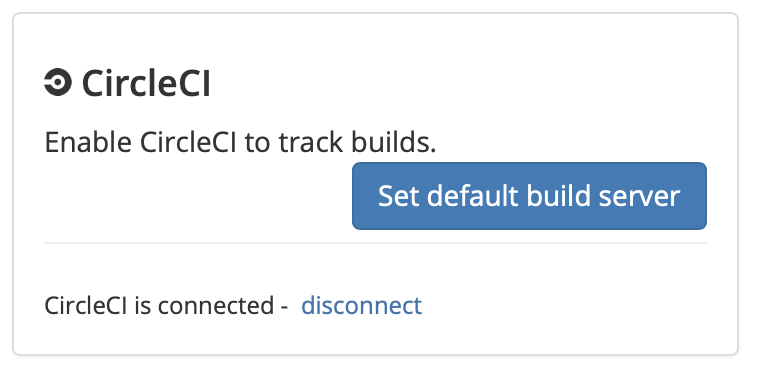

# CircleCI

## About the integration

The CircleCI integration provides Sleuth with the ability to track your CircleCI builds and associate them with corresponding deploys. 

## Setting up the integration

To add the Sleuth CircleCI integration:

* Click **Integrations** in the sidebar.
* Click the **Builds** tab, then click **enable** in the CircleCI card.    
* Enter your CircleCI API Token, then press **Save**. To get your CircleCI API Token, make sure you're logged in to your CircleCI account, then click **generate**.    

## Configuring the integration

## Removing the integration


This section under construction.


## Notes

What does CircleCI report back to Sleuth?

New category of information. How we grab issue data when we get a deployment, we

How does it know which deploy to associate? 

Give me all your recent builds, give me SHA and let's see if it's same SHA. Git sends SHA to Circle, Circle grabs that SHA. Just tells Sleuth how many builds you do. 

