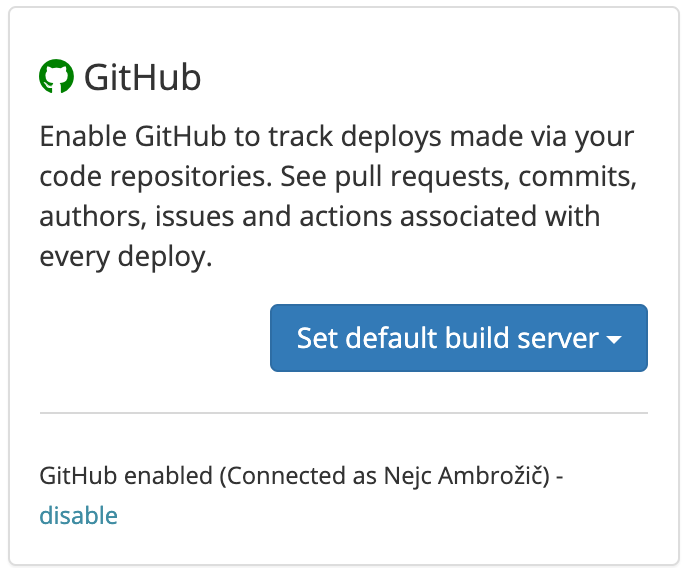

# Github Actions

## About the integration

The Github Actions integration provides Sleuth with the ability to track your Github Actions and associate them with your corresponding Sleuth deploys. Once configured, the integration silently monitors your deployment activity, and ties your Github workflows with associated deployments you make to your integrated change sources by matching the git SHAs from your code repos. Sleuth then shows you a snapshot of your build state at the time of deploy. 

## Setting up the integration

Github Actions integration reuses the same credentials used to connect [Github Code Deployment integration](../code-deployment/github.md).

## Configuring the integration

To configure the Github Actions integration, you will need to set a default build server: 

1. Click **Integrations** in the sidebar, then click the **CI/CD** tab. 
2. Click the **Set default build server** dropdown. \
     
3. Select a project to set as the default build server. You'll need to add a code deployment to the selected project if you haven't already done so. 

Now that the Github Actions integration is configured, you will begin seeing information displayed in the Builds tab of a [deploy](../../modeling-your-deployments/deploy-cards.md).
