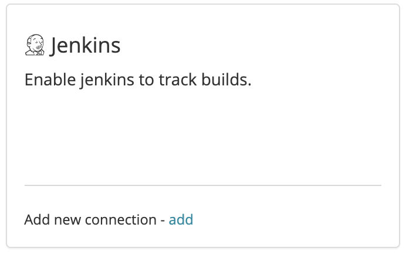

# Jenkins

## About the integration

The Jenkins integration provides Sleuth with the ability to track your Jenkins builds and associate them with your corresponding Sleuth deploys. Once configured, the Sleuth Jenkins integration silently monitors your deployment activity, and ties your Jenkins builds with associated deployments you make to your integrated change sources by matching the git SHAs from your code repos. Sleuth then shows you a snapshot of your build state at the time of deploy.

## Setting up the integration

To add the Sleuth Jenkins integration:

1. Click **Integrations** in the sidebar.
2. Click the\*\* Builds\*\* tab, then click **enable** in the Jenkins card.\
   
3. Enter your Jenkins instance publicly accessible URL, your username and API token, then press **Save**. You can generate the API token through Jenkins UI at `<YOUR_JENKINS_URL>/user/<YOUR_USERNAME>/configure`
4. On successful integration, you'll see new **Jenkins connection** displayed in the Jenkins tile. You'll configure the default build server later.\
   .png>)

## Configuring the integration

To configure the Jenkins integration, you will need to set a default build server:

1. Click **Integrations** in the sidebar, then click the **Builds** tab.
2. Click the **Set default build server** dropdown.\
   
3. Select a project to set as the default build server. You'll need to add a code deployment to the selected project if you haven't already done so.

Now that the Jenkins integration is configured, you will begin seeing information displayed in the Builds tab of a [deploy](../../modeling-your-deployments/deploy-cards.md).
