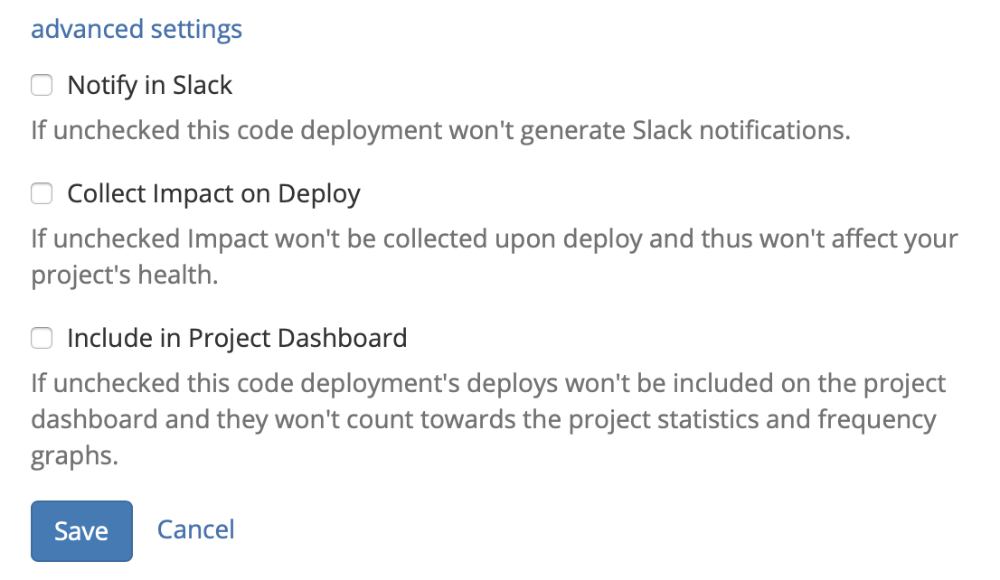

# GitHub

## About the integration 

Code deployments are one of the key sources of change Sleuth needs to do its job. Once a code deployment is integrated as a change of source, Sleuth immediately begins its analysis, looking at your commit history, number of authors, deploy frequency, size of commits, and other data to give you a full picture of how you and your team are managing your project's codebase. You'll instantly see the [Trend Graph](../../../resources/terminology.md#dashboard) come to life with a complete snapshot that gives you the information you need to start deploying faster.

Integrating GitHub with Sleuth is simple. If you're setting connecting to a personal GitHub repo, you just need your credentials. If you're part of a GitHub organization and aren't the owner, you will need permission to allow Sleuth to connect to the repo \(after you connect you'll be able to select individual private or public repositories\).

You can connect as many repositories to a project as you'd like; be sure to name them accordingly in Sleuth. You will also be able to tell Sleuth whether it should [manually register](../../manual-changes.md) each deploy or automatically create deploys [for every push to or tag on branch](../../../resources/terminology.md#deploy-tracking-type); it's completely up to you. This setting can be changed at any time. Additionally, you can configure your target branch to [lock](../../../resources/terminology.md#locking) if it contains unreleased code.

Check out the [Bitbucket](bitbucket.md), [GitLab](gitlab.md), [Jira](../../issue-trackers/jira.md), or [Clubhouse](../../issue-trackers/clubhouse.md) integration pages if you'd like to track your issues using those tools instead of or in addition to GitHub.

## Setting up the integration

To set up the Sleuth GitHub integration: 

1. Click **Integrations** in the left sidebar, then click **Change Sources**. 
2. In the _GitHub_ tile, click **connect**. 
3. Sign in to your GitHub account. If enabled, enter your 2FA code and click **Verify**. Don't worry, you'll select the GitHub repo to connect to your Sleuth project later.      
4. On successful integration, you'll see _GitHub is connected as {GitHub user account}_ displayed in the GitHub tile, and the GitHub logo will turn green. You'll next configure the code deployment to connect your repo to a project. 

## Configuring the integration

You now need to add a GitHub repo to a Sleuth project. This source of change is the repo the configured Sleuth project will monitor and report in the [Dashboard](../../../dashboard/) on each and every deploy you make to that repo, along with any other change sources you have connected to your project. 

To configure the GitHub integration: 

1. After step \#4 above, you will be taken back to the GitHub integration tile. On the GitHub tile, click the **Add code deployment** dropdown.    
2. Select the [Sleuth project](../../../projects.md) you wish to add a chance source to from the dropdown list.    
3. In the _Add a new Code Deployment change source_ screen, you must configure which code repo and branch to monitor; give the code deployment a name; select the [deploy tracking type](../../../resources/terminology.md#deploy-tracking-type); and tell Sleuth whether to [lock the target branch](../../../resources/terminology.md#deployment-locking) if it has unreleased code.  __ 

### Advanced Settings

The preferences in Advanced Settings allow you to control the information flow from a deploy. You can control whether a deploy affects your project's health, shows up in notifications or is included in the project dashboard. 

All settings are on \(checked\) by default. However, there might be some code that you don't want affecting your frequency graph, or a change source points to a portion of your codebase that contains fragile code, which you don't want affecting your repo's health. 

For example, [Sleuth Documentation](https://app.sleuth.io/sleuth/deployments/documentation) is part of the Sleuth application repo. However, we have disabled **Collect Impact on Deploy** for documentation. Even though we treat documentation as code \(our documentation files are written in Markdown\), the impact of deploying documentation shouldn't impact the health trend of our code repo. 

The preferences available in Advanced Settings are: 

#### **Notify in Slack**

With _Notify in Slack_ checked, all activity in this change source will generate a Slack notification in accordance with any project- and organization-level Slack preferences that have already been set. 

#### **Collect Impact on Deploy**

With _Collect Impact on Deploy_ checked, any impact measurements generated by this change of source are applied to your project's collective [health](../../../resources/terminology.md#health) metrics. 

#### **Include in Project Dashboard**

With _Include in Project Dashboard_ checked, all the deploys for this change source will be included in the project dashboard and frequency graph. 

## Removing the integration

#### If you wish to dissolve the GitHub integration for the organization: 

1. Click on **Integrations** in the left sidebar, then on **Change Sources**. 
2. In the GitHub integration card, click **disconnect**.

The GitHub integration is disconnected and no longer available to any projects within that organization. 

