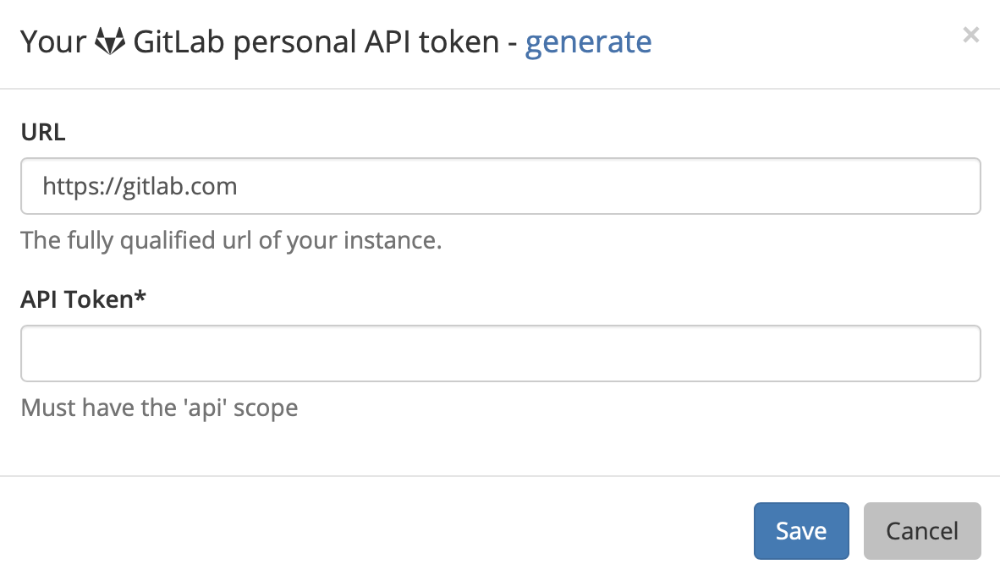
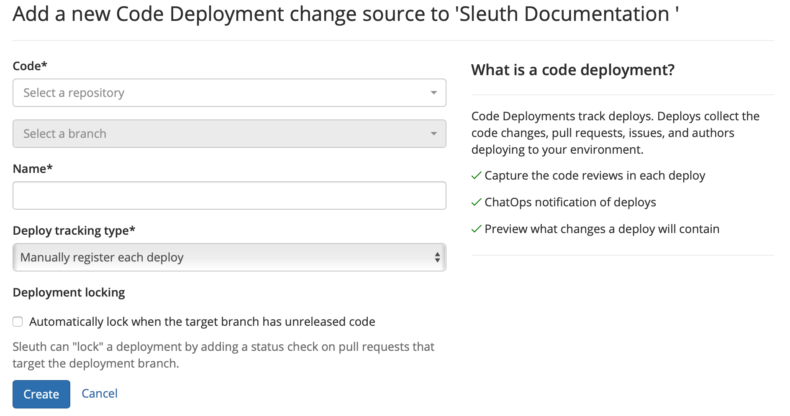

# GitLab

## About the integration  

Integrating GitLab with Sleuth is simple. If you're connecting to a personal GitLab repo, you just need your credentials. If you're part of an organization and aren't the owner, you will need permission to allow Sleuth to connect to the repo—after you connect you'll be able to select individual private or public repositories.

You can connect as many repositories to a project as you'd like; be sure to name them accordingly in Sleuth. You will also be able to tell Sleuth whether it should [manually register](../../manual-changes.md) each deploy or automatically create deploys for every push to or tag on branch—it's completely up to you. This setting can be changed at any time. Additionally, you can configure your target branch to [lock](../../../resources/terminology.md#locking) if it contains unreleased code.

Check out the [Bitbucket](bitbucket.md), [Clubhouse](../../issue-trackers/clubhouse.md), [GitHub](github.md), [Jira](../../issue-trackers/jira.md), or [Linear](../../issue-trackers/linear.md) integration pages if you'd like to track your issues using those tools instead of or in addition to GitLab.

#### Check out this video by Sleuth CTO Don Brown on how to get started with Sleuth and GitLab



## Setting up the integration

To set up the GitLab integration: 

1. Click **Integrations** in the left sidebar, then click **Change Sources**. 
2. In the _GitLab_ tile, click **enable**. 
3. You must grant Sleuth access to your GitLab account. Don't worry, you'll select the GitLab repo to connect to your Sleuth project later.   
4. On successful integration, _GitLab enabled_ will be displayed in the GitLab tile. You'll next configure the code deployment to connect your repo to a project. 

## Configuring the integration

You now need to add a GitLab repo to a Sleuth project. This source of change is the repo the configured Sleuth project will monitor and report in the [Dashboard](../../../dashboard-1/dashboard.md) on each and every deploy you make to that repo, along with any other change sources you have connected to your project. 

To configure the GitLab integration: 

1. After step \#4 above, you will be taken back to the GitLab integration tile. On the GitLab tile, click the **Add code deployment** dropdown. 
2. Select the [Sleuth project](../../../projects.md) you wish to add a chance source to from the dropdown list. 
3. In the _Add a new Code Deployment change source_ screen, you must configure which code repo and branch to monitor; give the code deployment a name; select the [deploy tracking type](../../../resources/terminology.md#deploy-tracking-type); and tell Sleuth whether to [lock the target branch](../../../resources/terminology.md#deployment-locking) if it has unreleased code.  __ 

## Removing the integration

#### If you wish to dissolve the **GitLab** integration for the organization: 

1. Click on **Integrations** in the left sidebar, then on **Change Sources**. 
2. In the GitLab integration card, click **disable**.

The GitLab integration is disconnected and no longer available to any projects within that organization. 

