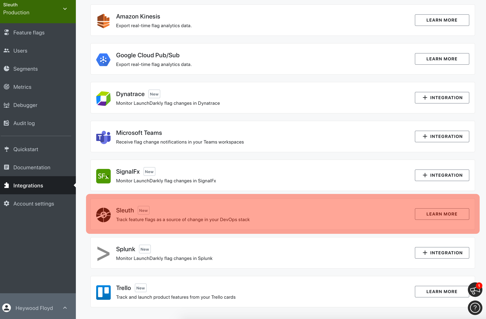
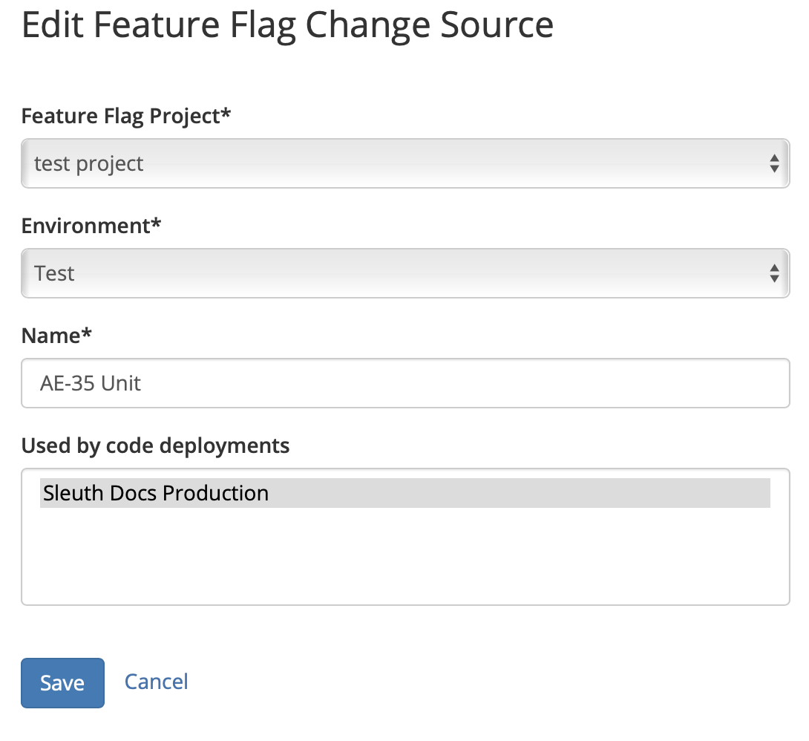

# LaunchDarkly

## About the integration  

Feature flags are an integral part of agile software development, and an important variable in deploying a successful CI/CD pipeline. Making high-impact changes with minimal risk and maximum control of your applications helps deliver quality software to your customers. 

The Sleuth LaunchDarkly integration provides a powerful way to track how your feature flags affect the quality of your deploys over time. The LaunchDarkly integration enables Sleuth to track changes made via your LaunchDarkly features flags.

Before you start you should already have a LaunchDarkly account, and your environment setup and running. If not, head over to [LaunchDarkly](https://app.launchdarkly.com/) to get things started. 

## Setting up the integration

To add the LaunchDarkly integration:

1. Click **Integrations** in the sidebar.
2. Click **connect** in the LaunchDarkly Change Sources card.


You must add Sleuth as an Authorized Application in the corresponding LaunchDarkly environment that contains the feature flags you want tracked.  
For more information, [read the LaunchDarkly documentation](https://docs.launchdarkly.com/integrations/oauth).


3. On successful integration, you'll see _LaunchDarkly is connected as {LaunchDarkly user account}_ displayed in the LaunchDarkly tile. 

4. That’s it—Sleuth will now track your feature flags as a source of change. Read [**Dashboard**](../../../dashboard.md) for more information on how feature flag issues are communicated within your project’s deploy cards. 

## Configuring the integration

You now need to add a LaunchDarkly project and environment to a Sleuth project as a feature flag change source. This source of change is the project that Sleuth will monitor and report in the [Dashboard](../../../dashboard.md) on each and every deploy you make to that repo, along with additional information from any other connected change sources report t. 

To configure the LaunchDarkly integration: 

1. After step \#4 above, you will be taken back to the LaunchDarkly integration tile. On the LaunchDarkly tile, click the **Add feature flags** dropdown.    
2. Select the [Sleuth project](../../../projects.md) you wish to add a feature flag chance source to from the dropdown list.    
3. In the _Edit Feature Flag change source_ screen, you must configure which feature flag project and environment to monitor and give the change source a name. Any Sleuth projects currently using feature flags as a change source are displayed in the **Used by code deployments** section.   __ 

## Removing the integration

#### If you wish to dissolve the **LaunchDarkly** integration for the organization: 

1. Click on **Integrations** in the left sidebar, then on **Change Sources**. 
2. In the LaunchDarkly integration card, click **disconnect**.

The LaunchDarkly integration is disconnected and no longer available to any projects within that organization. 

