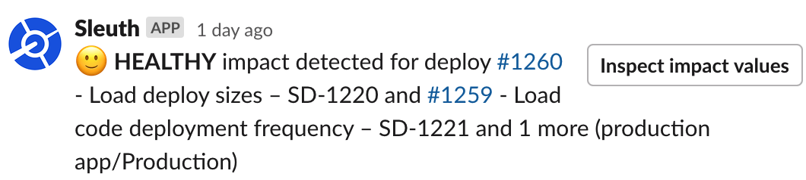
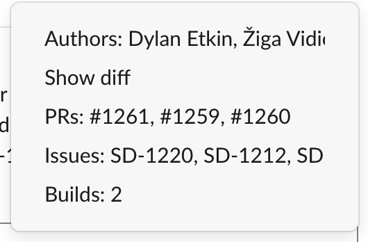

# Slack

## About the integration  

Keep your teams and other principals informed throughout the entire CI/CD lifecycle by using Slack as your main communication channel. No more bloated distribution lists, and bombarding your team with a barrage of emails. Use Slack's powerful communications features to keep development teams informed about your code deploys, and your entire organization up to date on progress.

Agile teams will spend most of their time viewing the [Dashboard](../../dashboard-1/dashboard.md) to get the granular detail they need to stay informed on the status of deploys, impact, magnitude, and the breadth and scope of information Sleuth provides. Other members of your organization, however, might only want a quick update on your team's progress without getting into the weeds. Slack messages provide just that—automated, easily-digestable messages where they can view: 

* when your deploy occurred; 
* what was deployed; 
* who the author was;
* how big the deploy was; 
* the commit hash; 
* how many commits, PRs, issues, and changes were in the deploy; 
* any [Jira](../issue-trackers/jira.md) issues associated with the deploy; and
* a link to the Sleuth deploy card, where even more information is available.  


A [Jira integration](../issue-trackers/jira.md) is required to view associated Jira issues in automated Slack messages from Sleuth.  


Before you start, you should already have a Slack account. Additionally, you should create channels that you plan to use for messaging in Slack before setting up the integration. Sleuth will ask for the Slack channel where it should send its messages to. You can create as many channels necessary to target various groups or individuals. You might have different audiences, who might have different needs. 

Slack integration is setup and configured in a Sleuth organization. All Sleuth projects created within the Sleuth organization have access to the configured Slack space. This enables Slack notifications to be **broadcast to everyone** who has access to the Slack space. When a channel is configured with a Sleuth project, anyone who follows that Slack channel will receive all messages sent to that channel. 

Sleuth can also be setup to send **individual Slack messages**. For example, instead of broadcasting a message to all channel subscribers of a commit, pull request or a locked repo, you might only want to notify the author \(or all authors who made at least one commit\), or only the individual who initiated the deploy. 


To receive messages from the Sleuth bot, recipients must be registered both in your code repo \(i.e., GitHub, Bitbucket, etc.\) and also in Sleuth. 



Read the [Sleuth Privacy Policy](https://www.sleuth.io/privacy) for information regarding the collection, use, and disclosure of Personal Information we collect.


## Setting up the integration

1. Click **Integrations** in the sidebar.
2. In the **Chat Ops** &gt; **Slack** card, click **enable**. 
3. Click **Allow** to make the integration. 


You must add Sleuth as an Authorized Application in Slack. For more information, [read the Slack documentation](https://api.slack.com).



Adding a third-party integration to Slack must be authorized by your Slack App Manager. Slack allows you to message the App Manager directly from the _Request to install_ dialog, as shown below. Once authorization is granted, you can proceed with the integration.


4. Upon a succesful connection to your Sleuth account, the message **Slack enabled \(Connected to workspace** _**&lt;workspace name&gt;**_**\)** is displayed in the tile. 


The Slack integration is done at the [organization](../../resources/terminology.md#information-architecture-ia) level. Since multiple [projects](../../projects.md) can exist within an organization, you'll want to go in to each project and configure notifications individually. This is especially important for individual Slack notifications, such as notifying the author of a commit and/or the person responsible for initiating deploying. 


## Configuring the integration

Sleuth will now use Slack to relay important deploy information to your team, as well as individual notifications to commit authors and/or deploy initiators. 

### Broadcasting to channels

With the Slack integration made to your organization, you can fine-tune Slack notifications within each project. Depending on how many Sleuth projects you have and the various teams working on those projects, it might be the case that not every person in configured organization will want to receive notifications on projects they're not working on. 


Don't forget to set the security on your Slack channels to **Public** or **Private**. If you select **Private**, you will need to invite the Sleuth "bot" to the channel first. 


#### To configure channel notifications: 

1. Select the project you wish to modify in the project dropdown in the sidebar. 
2. Click on **Project Settings**, then click **Slack Notifications**. 
3. Start typing the name of the channel you wish to broadcast to in the _Slack channel_ field. A list of available channels will auto-populate. Select the preferred broadcast channel for the project you're currently in. 
4. Press **Save**. 

The selected Slack channel will start receiving deployment notifications similar to the one shown below: 

### Personal Slack notifications

Personal Slack notifications means that you'll be notified instantly when your code or changes that you were involved in ship. No more long-polling your build system to see if that code finally made it out to production, or checking your Jira instance to see if the issues have been moved to Done.

If you've configured Impact for your deploys and Sleuth detects that your change was unhealthy, you'll know moments after deploy. You'll be to see the impact of your changes in real-time, all directly from your Slack client. 

When you receive a deployment notification in Sleuth, you can: 

* Click **View deploy** to view all detailed information that led up to the deployment. 
* Clickto view a dropdown \(see screenshot below\) that displays detailed deployment information, including:
  * All **authors** involved in the deployment. _Opens the Authors tab in Sleuth_
  * All the **diffs** \(changes\) that comprised the deployment. _Opens the change compare section of your code repository \(i.e., Bitbucket, GitHub, or GitLab\)_
  * All the **pull requests** that comprised your deployment. _Opens the Authors tab in Sleuth_
  * All the **issues** created during the deployment. _Opens the Issues tab in Sleuth_
  * All the **builds** that ran during the deployment. _Opens the Builds tab in Sleuth_

## Removing the integration

#### If you wish to dissolve the **Slack** integration for the organization: 

1. Click on **Integrations** in the left sidebar, then on **Chat Ops**. 
2. In the Slack integration card, click **disable**. The message **Slack disabled** is displayed in the Slack integration card once the integration is dissolved.

The Slack integration is disconnected and no longer available to any projects within that organization. Any project-level modifications you made to the Slack integration will be lost. 

## Search using Slack

If your organization has a Slack integration, you can [use the Slack app](../../dashboard-1/search.md#searching-with-slack) to search through your deploy history.   

