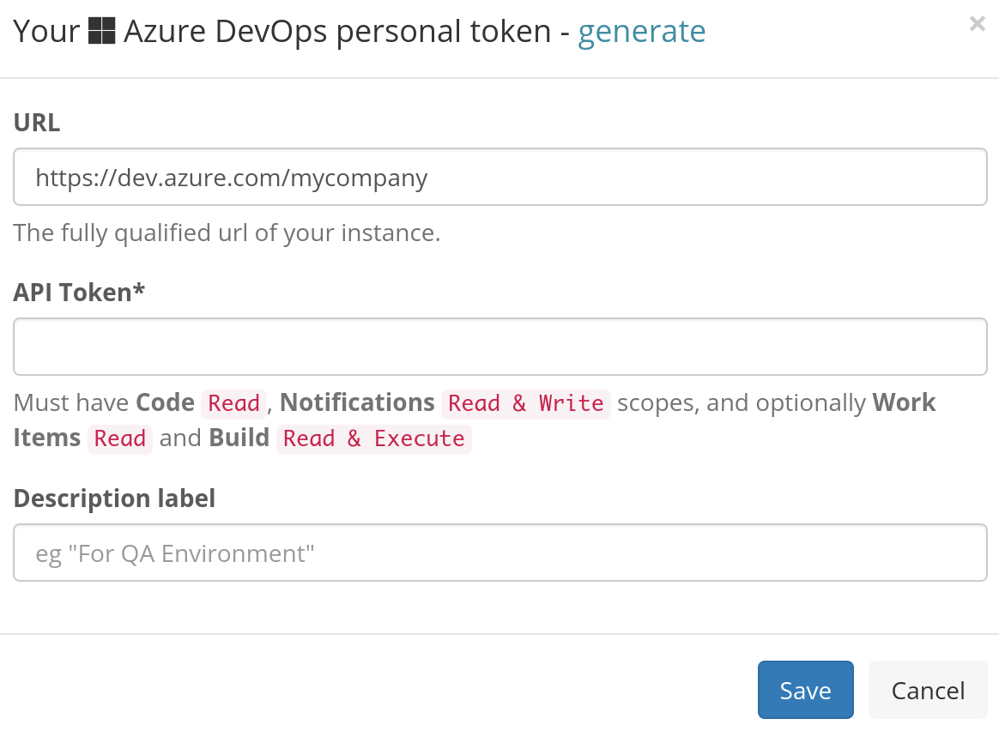

# Azure DevOps

## About the integration  

Integrating Azure DevOps with Sleuth is simple. If you're connecting to a personal Azure DevOps repo, you just need your credentials. If you're part of an organization and aren't the owner, you will need permission to allow Sleuth to connect to the repo—after you connect you'll be able to select individual private or public repositories.

The integration is best tested against Azure DevOps Services, however, it should work for Azure DevOps Server as well. Which is which?

* Azure DevOps Services (formerly known as Visual Studio Team Services, or VSTS_)_ is a cloud-based solution 
* Azure DevOps Server (formerly known as Team Foundation Server, or TFS) is an on-premises offering

## Setting up the integration

To set up the Azure DevOps integration: 

1. Click **Integrations** in the left sidebar, then click **Change Sources**. 
2. In the _Azure DevOps_ tile, click **enable**. 
3. You must grant Sleuth access to your Azure DevOps account.  Don't worry, you'll select the Azure DevOps repo to connect to your Sleuth project later. \
     
4. In a separate browser tab or window, visit your Azure DevOps account, and under **User settings**, click on **Personal Access Tokens** and generate a token with the required scopes. The **Work Items** and **Build** scopes are only necessary if you want to configure issue and build integration. Paste this token into the Sleuth form. 
5. On successful integration, _Azure DevOps enabled_ will be displayed in the Azure DevOps tile. You'll next configure the code deployment to connect your repo to a project. 

## Configuring the integration

You now need to add a [code deployment](../../modeling-your-deployments/code-deployments/) for your Azure DevOps repo to a Sleuth [project](../../modeling-your-deployments/projects/). Once configured and you start [registering deploys](../../modeling-your-deployments/code-deployments/how-to-register-a-deploy.md) Sleuth will be tracking deploys for your code changes.To configure the Azure DevOps integration: 

1. After step #4 above, you will be taken back to the Azure DevOps integration tile. On the Azure DevOps tile, click the **Add code deployment** dropdown. 
2. Select the [Sleuth project](../../modeling-your-deployments/projects/) you wish to add a chance source to from the dropdown list. 
3. Follow the instructions for [setting up a new code deployment](../../settings/project/code-deployments.md)

## Removing the integration

#### If you wish to remove the **Azure DevOps** integration for the organization: 

1. Click on **Integrations** in the left sidebar, then on **Change Sources**. 
2. In the Azure DevOps integration card, click **disable**.

The Azure DevOps integration is disconnected and no longer available to any projects within that organization. 
