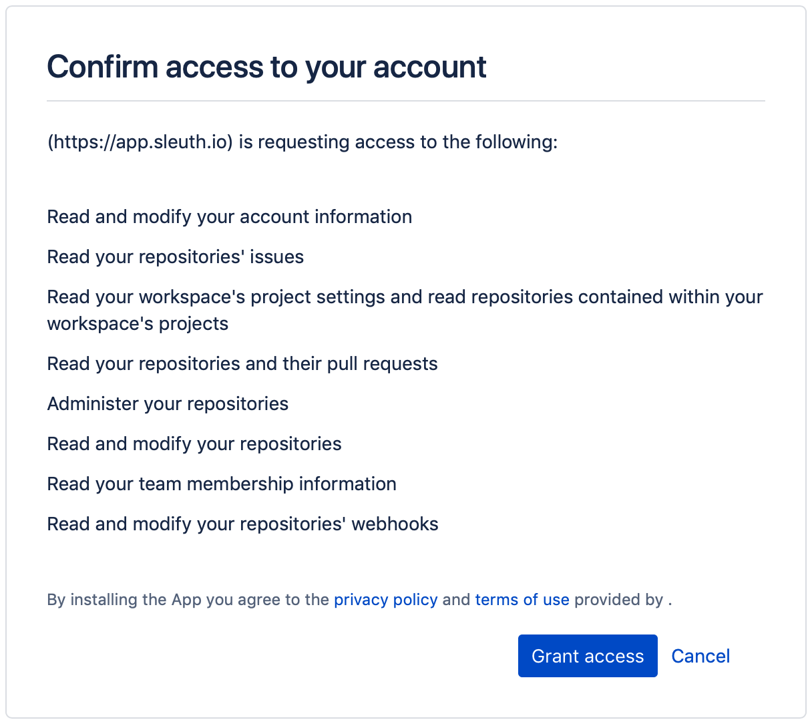

# Bitbucket

## About the integration 

Integrating Bitbucket with Sleuth is simple. If you're connecting to a personal Bitbucket repo, you just need your credentials. If you're part of a Bitbucket organization and aren't the owner, you will need permission to allow Sleuth to connect to the repo (after you connect you'll be able to select individual private or public repositories).

If you are using Bitbucket issues to track issues, Sleuth will automatically discover your referenced issues once the integration is configured. You can still use other [issue tracker integrations](../issue-trackers/) if you don't use Bitbucket's issues.


Check out the Sleuth for Bitbucket integration [in the Atlassian Marketplace](https://marketplace.atlassian.com/apps/1223448/sleuth-for-bitbucket?hosting=cloud\&tab=overview).


## Setting up the integration

To set up the Sleuth Bitbucket integration:

1. Click **Add** in the top navigation bar and select **Integration** from the list.
2. Select **Code** from the drop-down located in the top right.
3. In the **Bitbucket** tile, click **Enable**.
4. Grant Sleuth access to your Bitbucket account by clicking **Grant access** in the confirmation dialog. You will have the chance to select specific repo(s) for your Sleuth project(s) later.\
   
5. On successful integration, you'll see **Bitbucket** marked as **Enabled** and the connection listed in the format **Connected as `<Bitbucket user account>`**.\
    (1) (1).png>)

## Configuring the integration

After the initial setup is complete, the Bitbucket integration can be used to set up:

* a **code deployment**: select a Sleuth project from the list and then follow the instructions for [creating a code deployment](https://help.sleuth.io/modeling-your-deployments/code-deployments/creating-a-deployment)
* an **issue tracker**: select a Sleuth project from the list to set Bitbucket as the `Issue integration provider` for the selected project

<figure><figcaption></figcaption></figure>

## Removing the integration

#### If you wish to dissolve the Bitbucket integration for the organization:

1. Click the **Add** button in the top nav and select **Integrations** from the list.
2. Expand the **Bitbucket** integration card, and click **Remove** next to the connection you wish to remove. A confirmation screen will appear warning you of the consequences of this action and prompting you to confirm your decision -> click **Confirm**.

After all connections are removed, the Bitbucket integration is then disconnected and no longer available for any projects within that organization.
