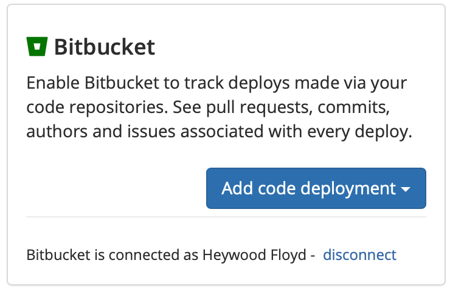
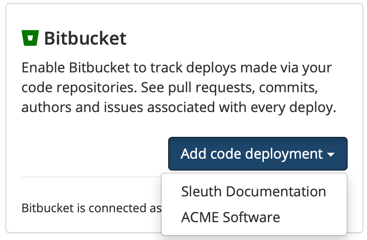

# Bitbucket

## About the integration  

Integrating Bitbucket with Sleuth is simple. If you're connecting to a personal Bitbucket repo, you just need your credentials. If you're part of a Bitbucket organization and aren't the owner, you will need permission to allow Sleuth to connect to the repo \(after you connect you'll be able to select individual private or public repositories\).

If you are using Bitbucket issues to track issues, Sleuth will automatically discover your referenced issues once the integration is configured. You can still use other [issue tracker integrations](../issue-trackers/) if you don't use Bitbucket's issues.


Check out the Sleuth for Bitbucket integration [in the Atlassian Marketplace](https://marketplace.atlassian.com/apps/1223448/sleuth-for-bitbucket?hosting=cloud&tab=overview). 


## Setting up the integration

To set up the Sleuth Bitbucket integration: 

1. Click **Integrations** in the left sidebar, then click **Change Sources**. 
2. In the _Bitbucket_ tile, click **enable**. 
3. You must grant Sleuth access to your Bitbucket account by clicking **Grant access** in the confirmation dialog. Don't worry, you'll select the Bitbucket repo to connect to your Sleuth project later.    
4. On successful integration, you'll see **Bitbucket enabled \(Connected as** _**&lt;Bitbucket user account&gt;**_**\)** displayed in the Bitbucket tile. You'll next configure the code deployment to connect your repo to a project. 

## Configuring the integration

You now need to add a Bitbucket repo to a Sleuth project. This source of change is the repo the configured Sleuth project will monitor and report in the [Dashboard]() on each and every deploy you make to that repo, along with any other change sources you have connected to your project. 

To configure the Bitbucket integration: 

1. After step \#4 above, you will be taken back to the Bitbucket integration tile. On the Bitbucket tile, click the **Add code deployment** dropdown.    
2. Select the [Sleuth project](../../modeling-your-deployments/projects/) you wish to add a chance source to from the dropdown list.    
3. Follow the [instructions for setting up a new code deployment](../../settings/project/code-deployments.md)

## Removing the integration

#### If you wish to dissolve the Bitbucket integration for the organization: 

1. Click on **Integrations** in the left sidebar, then on **Change Sources**. 
2. In the Bitbucket integration card, click **disable**. The message **Bitbucket disabled** is displayed in the Bitbucket integration card once the integration is dissolved.

The Bitbucket integration is disconnected and no longer available to any projects within that organization. 

