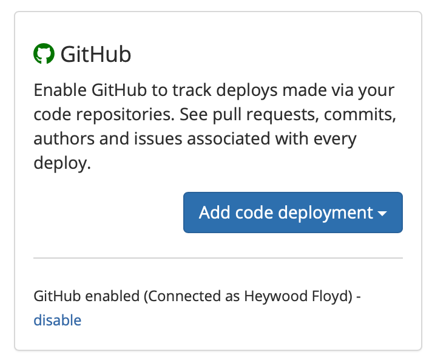
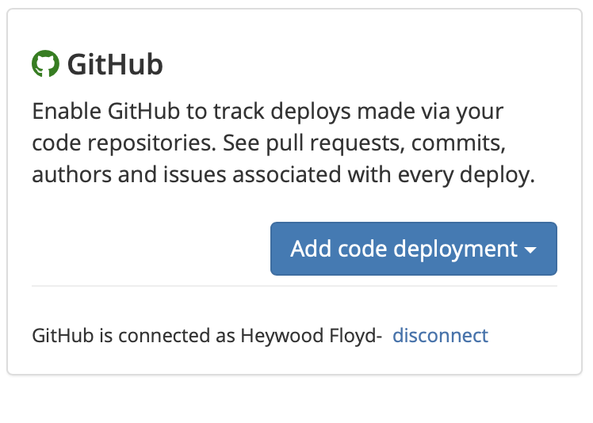
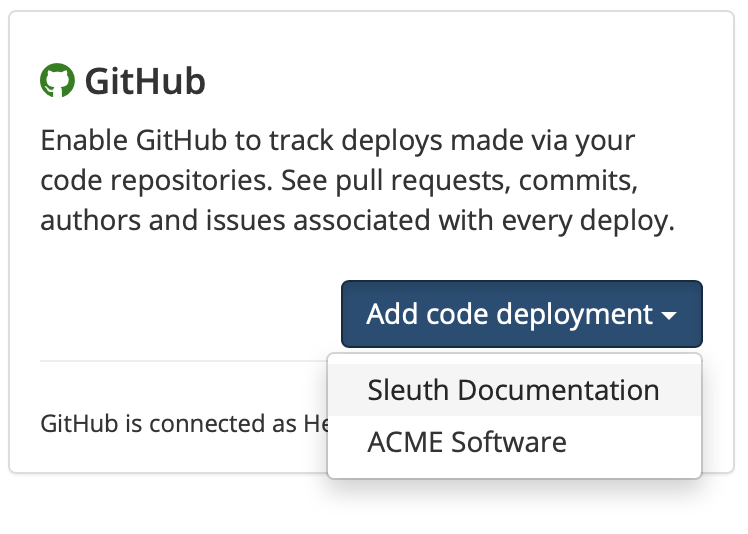

# GitHub

## About the integration 

Integrating GitHub with Sleuth is simple. If you're setting connecting to a personal GitHub repo, you just need your credentials. If you're part of a GitHub organization and aren't the owner, you will need permission to allow Sleuth to connect to the repo (after you connect you'll be able to select individual private or public repositories).

If you are using GitHub issues to track issues, Sleuth will automatically discover your referenced issues once the integration is configured. You can still use other [issue tracker integrations](../issue-trackers/) if you don't use GitHub issues.


Check out the Sleuth app in the [GitHub marketplace](https://github.com/marketplace/sleuth-deployment-tracking).


## Setting up the integration

To set up the Sleuth GitHub integration:

1. Click **Integrations** in the left sidebar.
2. Select **Code** from the drop down located in the top right.
3. In the _GitHub_ tile, click **Enable**.
4. Select **Code** from the drop down located in the top right.&#x20;
5. Select either **All repositories** or **Only select repositories**. Note that if you choose **Only select repositories**, Sleuth will only be able to see the repos you select. (2).png>)
6. Click **Install & Authorize**.
7. Upon successful integration, you'll see **GitHub enabled (Connected as \_\<GitHub user account>**\_\*\*) \*\*displayed in the GitHub tile. You'll next configure the code deployment to connect your repo to a project.\
   

## Configuring the integration

You now need to add a [code deployment](../../modeling-your-deployments/code-deployments/) for your GitHub repo to a Sleuth [project](../../modeling-your-deployments/projects/). Once configured and you start [registering deploys](../../modeling-your-deployments/code-deployments/how-to-register-a-deploy.md) Sleuth will be tracking deploys for your code changes.

To configure the GitHub integration:

1. After step #4 above, you will be taken back to the GitHub integration tile. On the GitHub tile, click the **Add code deployment** dropdown.\
   
2. Select the [Sleuth project](../../modeling-your-deployments/projects/) you wish to add a chance source to from the dropdown list.\
   
3. Follow the instructions for [setting up a new code deployment\_ \_](../../settings/project/code-deployments.md)\_\_

## Adding more repositories

You've added "only select repositories" and want to add more? Head to integrations (bottom left), click the arrow to expand GitHub and follow "Inspect" link

 (1).png>)

## Removing the integration

#### If you wish to dissolve the GitHub integration for the organization:

1. Click on **Integrations** in the left sidebar, then on **Change Sources**.
2. In the GitHub integration card, click **disable**. The message **GitHub disabled** is displayed in the GitHub integration card once the integration is dissolved.

The GitHub integration is disconnected and no longer available to any projects within that organization.
