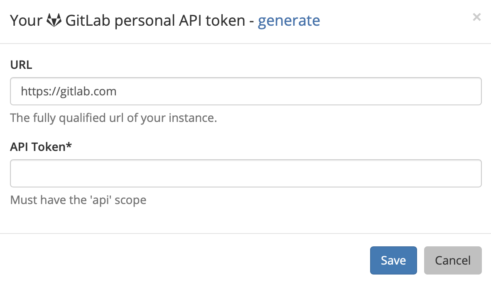

# GitLab

## About the integration  

Integrating GitLab with Sleuth is simple. If you're connecting to a personal GitLab repo, you just need your credentials. If you're part of an organization and aren't the owner, you will need permission to allow Sleuth to connect to the repo—after you connect you'll be able to select individual private or public repositories.

#### Check out this video by Sleuth CTO Don Brown on how to get started with Sleuth and GitLab



## Setting up the integration

To set up the GitLab integration: 

1. Click **Integrations** in the left sidebar, then click **Change Sources**. 
2. In the _GitLab_ tile, click **enable**. 
3. You must grant Sleuth access to your GitLab account. Don't worry, you'll select the GitLab repo to connect to your Sleuth project later. \
    
4. On successful integration, _GitLab enabled_ will be displayed in the GitLab tile. You'll next configure the code deployment to connect your repo to a project. 

## Configuring the integration

You now need to add a [code deployment](../../modeling-your-deployments/code-deployments/) for your GitLab repo to a Sleuth [project](../../modeling-your-deployments/projects/). Once configured and you start [registering deploys](../../modeling-your-deployments/code-deployments/how-to-register-a-deploy.md) Sleuth will be tracking deploys for your code changes.To configure the GitLab integration: 

1. After step #4 above, you will be taken back to the GitLab integration tile. On the GitLab tile, click the **Add code deployment** dropdown. 
2. Select the [Sleuth project](../../modeling-your-deployments/projects/) you wish to add a chance source to from the dropdown list. 
3. Follow the instructions for [setting up a new code deployment](../../settings/project/code-deployments.md)

## Removing the integration

#### If you wish to dissolve the **GitLab** integration for the organization: 

1. Click on **Integrations** in the left sidebar, then on **Change Sources**. 
2. In the GitLab integration card, click **disable**.

The GitLab integration is disconnected and no longer available to any projects within that organization. 
