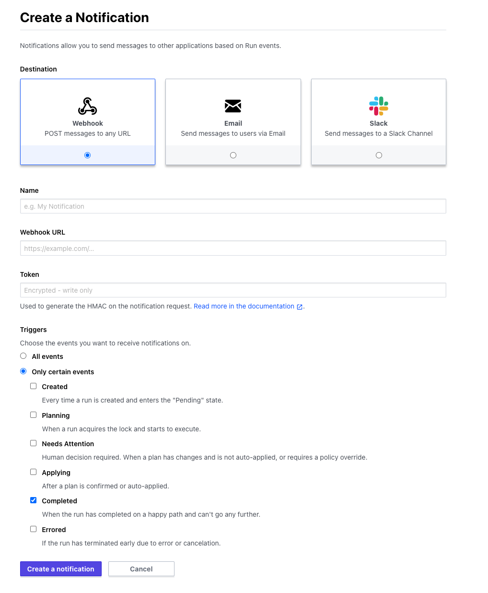

# Terraform Cloud

Sleuth doesn't yet have full integration with Terraform Cloud. However, you can use the Terraform Cloud [webhook notifications](https://www.terraform.io/docs/cloud/workspaces/notifications.html) to automatically register a deploy in Sleuth.

## Configure automatic deploy registration in Terraform Cloud

Follow the Terraform documentation to create a [webhook notification](https://www.terraform.io/docs/cloud/workspaces/notifications.html) for your workspace. You will encounter a screen like this:

**Name:** give your webhook a descriptive such as "_Sleuth deploy registration_**"**

**Webhook URL:** this URL should be the Sleuth registration URL for your code deployment. You can easily find this information via the link "Get setup instructions" in your code deployment dashboard. 


You must include your `api_key` and `environment` in the parameters of your registration URL. Since Terraform Cloud controls the contents of the webhook you can only tell Sleuth about these parameters by including them in the URL.

Your URL will look something like: https://app.sleuth.io/api/1/deployments/sleuth/terraform/register\_deploy?api\_key=456ee3322eeedoow&environment=Staging


**Triggers:** Sleuth only respects the **Completed** trigger. You can send the others but they'll be ignored

Save the webhook and now every time your Terraform plan completes it will automatically register the repositories latest change with Sleuth.


Terraform Cloud doesn't provide the commit SHA that it has applied in the webhook payload. As a result we are unable to determine exactly what change was applied. As a result a limitation of this integration is that Sleuth will register the last known change from your code repository as the deploy that was applied. This works well if you are applying every change you make or if you have setup your code deployment as a mono-repo. However, if you merge many changes and apply older changes after newer ones have been introduced into your branch your Sleuth deploys will be incorrect. In this case we suggest you use our Webhooks to register your changes once they've been made.


