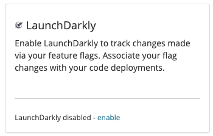
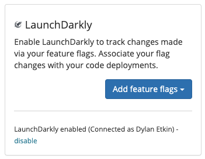

# LaunchDarkly

## About the integration 

Feature flags are an integral part of agile software development, and an important variable in deploying a successful CI/CD pipeline. Making high-impact changes with minimal risk and maximum control of your applications helps deliver quality software to your customers.

The Sleuth LaunchDarkly integration provides a powerful way to track how your feature flags affect the quality of your deploys over time. The LaunchDarkly integration enables Sleuth to track changes made via your LaunchDarkly features flags.

Before you start you should already have a LaunchDarkly account, and your environment setup and running. If not, head over to [LaunchDarkly](https://app.launchdarkly.com) to get things started.

## Setting up the integration

To add the LaunchDarkly integration:

1. Click **Integrations** in the sidebar.
2. Click **enable** in the LaunchDarkly Change Sources card.

3\. On successful integration, you'll see **LaunchDarkly enabled (Connected as \_\<LaunchDarkly user account>**\_\*\*) \*\*displayed in the LaunchDarkly tile.

4\. Once enabled you can now add a Feature flags to your existing projects. See [how to create feature flags](../../settings/project/feature-flags.md) for more details.

## Removing the integration

#### If you wish to dissolve the **LaunchDarkly** integration for the organization:

1. Click on **Integrations** in the left sidebar, then on **Change Sources**.
2. In the LaunchDarkly integration card, click **disable**. The message **LaunchDarkly disabled** is displayed in the LaunchDarkly integration card once the integration is dissolved.

The LaunchDarkly integration is disconnected and no longer available to any projects within that organization.
