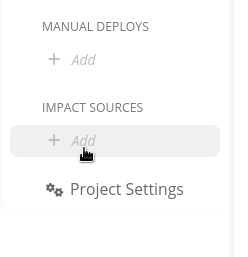
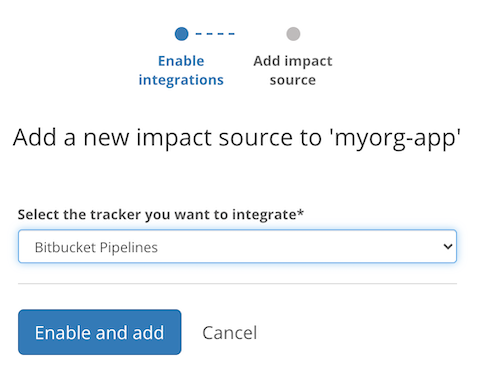
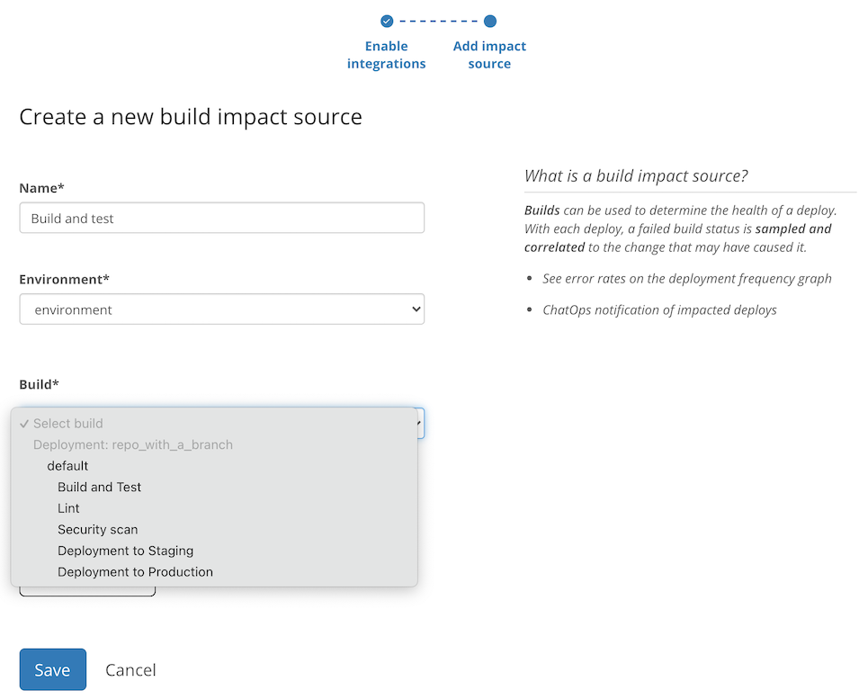

# Bitbucket Pipelines

## About the integration

Bitbucket Pipelines is an integrated CI/CD service built into Bitbucket. It allows you to automatically build, test, and even deploy your code based on a configuration file in your repository.

It is assumed you already have an active Bitbucket account and a repository with a working Bitbucket Pipelines configuration.

## Setting up the integration

Refer to the [general instructions on adding Bitbucket as a code integration](../../code-deployment/bitbucket.md).

You should also add at least one [Code deployment](../../../modeling-your-deployments/code-deployments/) based on a Bitbucket repository so that we may use it as a source of Bitbucket Pipelines builds.

## Configuring the integration

Once the integration is successful, find the **Impact sources** section in the sidebar and click the **+ Add** link nested under that section.

Select **Bitbucket pipelines** from the dropdown and continue by clicking **Enable and add**.

Give this build tracking instance a **name** and select which **build** or job inside a build should be used to base the impact measurements on.

That's it! Sleuth will now start verifying your deploys health by tracking whether the selected build/job is passing or failing. Head over to the Dashboard to start seeing your data in action in the project and deploy health graphs.

## Removing the integration

Refer to the [general instructions on removing Bitbucket as a code integration](../../code-deployment/bitbucket.md).
