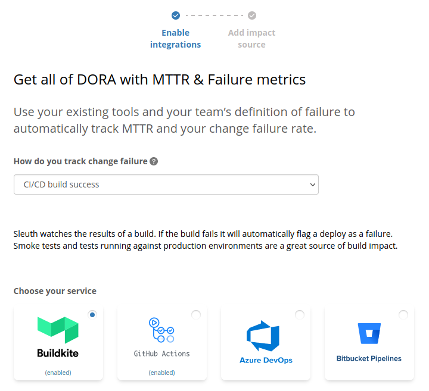
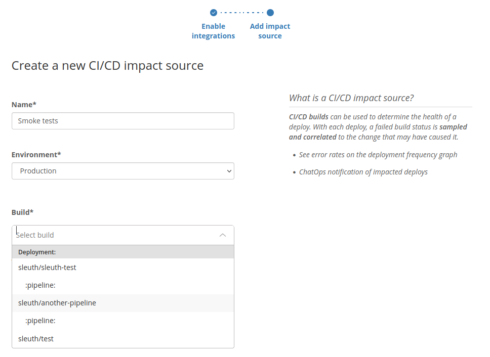

# Buildkite

## About the integration

Buildkite is a modern continuous integration and continuous delivery (CI/CD) platform. It allows you to build, test, and deploy your application using automated jobs that are triggered manually or as a consequence of various interactions with connected code repository.

It is assumed you already have an active Buildkite account and a repository with a working Buildkite configuration.

## Setting up the integration

Refer to the [general instructions on adding Buildkite integration](../../builds/buildkite.md).

You should also add at least one [Code deployment](../../../modeling-your-deployments/code-deployments/) which is using Buildkite so that we may use it as a source of Buildkite builds.

## Configuring the integration

Once the integration is successful, find the **Impact sources** section in the sidebar and click the **+ Add** link nested under that section.

Select **Buildkite** and continue by clicking **Enable and continue**.

Give this build tracking instance a **name** and select which **build** or job inside a build should be used to base the impact measurements on.

That's it! Sleuth will now start verifying your deploys health by tracking whether the selected build/job is passing or failing. Head over to the Dashboard to start seeing your data in action in the project and deploy health graphs.

## Removing the integration

Refer to the [general instructions on removing Buildkite integration](../../builds/buildkite.md).
