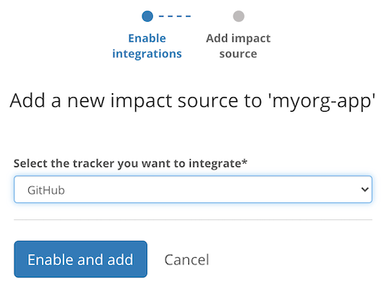
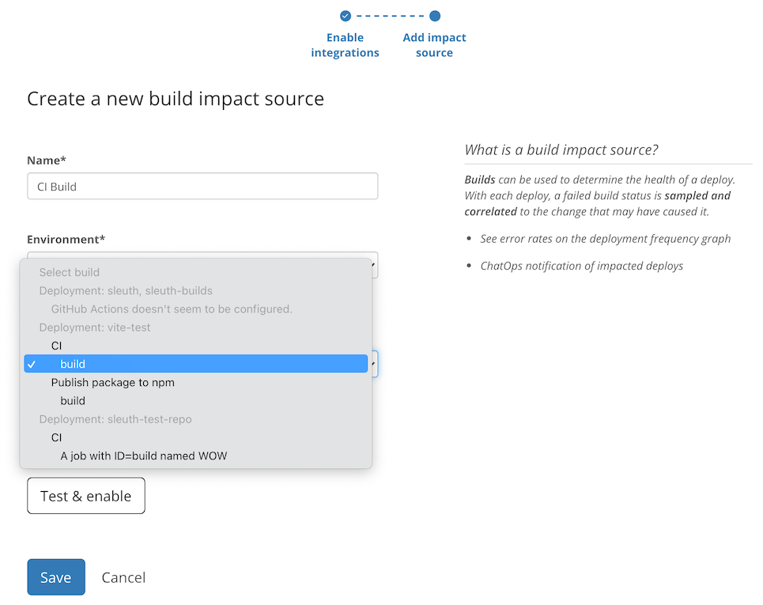

# GitHub Actions

## About the integration

GitHub Actions is the continuous integration tool provided by GitHub. It allows you to build, test, and deploy your application using automated jobs that are triggered manually or as a consequence of various interactions with your GitHub repository.

It is assumed you already have an active GitHub account and a repository with a working GitHub Actions configuration.

## Setting up the integration

Refer to the [general instructions on adding GitHub as a code integration](../../code-deployment/github.md).

You should also add at least one [Code deployment](../../../modeling-your-deployments/code-deployments/) based on a GitHub repository so that we may use it as a source of GitHub Actions builds.

## Configuring the integration

Once the integration is successful, find the **Impact sources** section in the sidebar and click the **+ Add** link nested under that section.

Select **GitHub** from the dropdown and continue by clicking **Enable and add**.

Give this build tracking instance a **name** and select which **build** or job inside a build should be used to base the impact measurements on.

That's it! Sleuth will now start verifying your deploys health by tracking whether the selected build/job is passing or failing. Head over to the Dashboard to start seeing your data in action in the project and deploy health graphs. 

## Removing the integration

Refer to the [general instructions on removing GitHub as a code integration](../../code-deployment/github.md).

